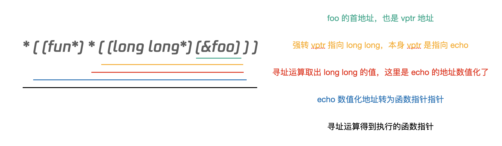

# 通过指针调用函数
分析测试 class 内存结构的时候，需要直接调用一个地址，这里的调用方式比较有趣，所以就记录一下。

比如有一段如下的代码:  
```
typedef void(*fun)(void);

class Foo {
    virtual void echo() {
        printf("Hello World\n");
    }

    virtual void echo2() {
        printf("balabalabala\n");
    }
};

int main(int argc, char* argv[]) {
    Foo foo;
    // 因为 private，所以无法直接访问
    // foo.echo();

    // 但是可以通过指针的方式来访问
    fun echo = *((fun*)*((long long*)(&foo)));
    echo();

    fun echo2a = *((fun*)*((long long*)(&foo)) + 1);
    echo2a();

    fun echo2b = *(fun*)(*((long long*)(&foo)) + 8);
    echo2b();
    return 0;
}
```
我们有一个 class，下面有两个 virtual private 方法（virtual 是为了方便拿到地址），正常来说我们是不能调用 echo 方法的，编译器会报错:  
> error: ‘virtual void Foo::echo()’ is private within this context

但是我们可以直接通过地址去调用，看起来很复杂，我们拆开来看一下:  
  

然后我们下面我们用指针的方式调用了 echo2 方法，这里有两种调用方式:  
1. 在 echo 指针指针层面直接+1，因为指针的大小是8，所以可以找到 echo2 指针
2. 在 echo 指针地址层面+8，先找到 echo2 对应的地址，然后强转为指针