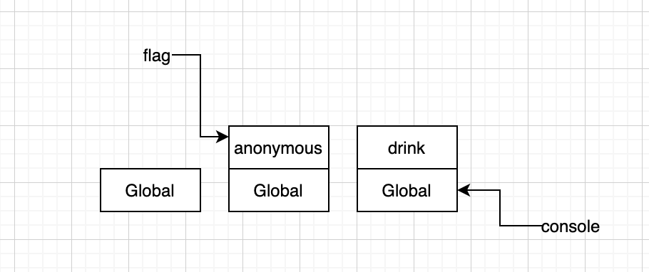
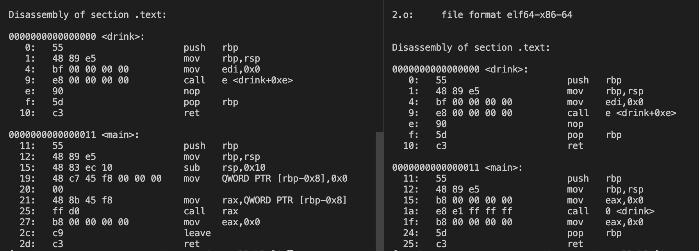

# callable-object
今天我们来聊一聊可调用对象，从底层来说，调用是指新建了栈帧，寄存器指向发生了变化。  
从直观上看可以加()执行的就是可调用对象！比如我们熟悉的 javascript 中函数。  

## javascript 中的 callable
```
function drink() {
    console.log('利利不流泪，喝酒喝到醉');
}

drink();
```
但是有没有想过，为什么这段代码可以按顺序执行？如果了解 C 或者 Java，程序的入口一定是一个 main 函数，为什么 js 中无需 main 函数了呢？

从 v8 源码一探究竟，这是因为 v8 会将整个 js 代码，包装成一个函数，源码位置如下：
```
// v8/src/execution/execution.cc

// ...
// ❗code 非常重要
Handle<Code> code =
      JSEntry(isolate, params.execution_target, params.is_construct);
  {
    // ...

    if (params.execution_target == Execution::Target::kCallable) {
      // clang-format off
      // {new_target}, {target}, {receiver}, return value: tagged pointers
      // {argv}: pointer to array of tagged pointers
      using JSEntryFunction = GeneratedCode<Address(
          Address root_register_value, Address new_target, Address target,
          Address receiver, intptr_t argc, Address** argv)>;
      // clang-format on
      JSEntryFunction stub_entry =
          JSEntryFunction::FromAddress(isolate, code->InstructionStart());

      Address orig_func = params.new_target->ptr();
      Address func = params.target->ptr();
      Address recv = params.receiver->ptr();
      Address** argv = reinterpret_cast<Address**>(params.argv);
      RuntimeCallTimerScope timer(isolate, RuntimeCallCounterId::kJS_Execution);
      // ❗下面是真正的执行
      value = Object(stub_entry.Call(isolate->isolate_data()->isolate_root(),
                                     orig_func, func, recv, params.argc, argv));
    // ...
```
Code 对象非常的重要，这个就是 v8 中函数执行的关键，v8 相关原话有:  
> Code describes objects with on-the-fly generated machine code.  
>
> JSFunctions are pairs (context, function code), sometimes also called closures.  
JSFunction(v8 内数据类型) 相比较 JSObject 重大的差异也就是多了 code 属性，这也就是 Function 可以执行，而 Object 无法执行的原因。  

其实我们将上面列子中的 js 代码，编译成字节码，也可以看出来整个文本可以执行的原因。  
```
[generated bytecode for function:  (0x06c008212561 <SharedFunctionInfo>)] // 注意点1
Parameter count 1
Register count 3
Frame size 24
         0x6c008212626 @    0 : 12 00             LdaConstant [0]
         0x6c008212628 @    2 : 26 f9             Star r1
         0x6c00821262a @    4 : 27 fe f8          Mov <closure>, r2
         0x6c00821262d @    7 : 62 3f 01 f9 02    CallRuntime [DeclareGlobals], r1-r2
         0x6c008212632 @   12 : 13 01 00          LdaGlobal [1], [0]
         0x6c008212635 @   15 : 26 f9             Star r1
         0x6c008212637 @   17 : 5d f9 02          CallUndefinedReceiver0 r1, [2] // 注意点3
         0x6c00821263a @   20 : 26 fa             Star r0
         0x6c00821263c @   22 : ab                Return 
Constant pool (size = 2)
Handler Table (size = 0)
Source Position Table (size = 0)

[generated bytecode for function: drink (0x06c0082125b9 <SharedFunctionInfo drink>)] // 注意点2
Parameter count 1
Register count 3
Frame size 24
         0x6c00821278a @    0 : 13 00 00          LdaGlobal [0], [0]
         0x6c00821278d @    3 : 26 f9             Star r1
         0x6c00821278f @    5 : 28 f9 01 02       LdaNamedProperty r1, [1], [2]
         0x6c008212793 @    9 : 26 fa             Star r0
         0x6c008212795 @   11 : 12 02             LdaConstant [2]
         0x6c008212797 @   13 : 26 f8             Star r2
         0x6c008212799 @   15 : 5a fa f9 f8 04    CallProperty1 r0, r1, r2, [4]
         0x6c00821279e @   20 : 0d                LdaUndefined 
         0x6c00821279f @   21 : ab                Return 
Constant pool (size = 3)
Handler Table (size = 0)
Source Position Table (size = 0)
```
没接触过字节码也没关系，从上面至少能看到 _generated bytecode for function_ 出现了两次，意味着有两个函数。  
**注意点2**那里有一个 drink 关键字，代表是我们显示声明的函数；**注意点1**那里就是整段 js 代码，被作为了一个匿名函数执行。  
_注意点3就是调用 drink 的地方。_

不过 js 本身是一个函数式编程语言，函数式是如何表现的我们不用多说，重点说一说「闭包」，闭包一词不可能有前端开发不知道(_哪怕没用过，面试也遇到过_)，那我们思考一下，为什么闭包可以跨越栈帧的限制？  
以下面这个函数为例:  
```
const drink = (function() {
    let flag = 0;
    return function() {
        if (++flag > 3) {
            console.log('利利喝不动了');
            return;
        }

        console.log('利利吨吨吨');
    };
})();

drink();
```
如果使用 d8 输出字节码，可以看到总共有三个 generated bytecode for function。整段执行的过程，我们先按常理猜测一下，函数执行作用域变化应该如下:    
  
这里总共有三个阶段，重点看后面两个。  
- 第二阶段是执行了匿名的自执行函数，此时声明了一个 flag 变量在对应的作用域。
- 第三阶段是执行 drink 函数，这里用到了两个变量。  
1. console，来自于上层的作用域，可以理解。
2. flag，这个就比较诡异了，**因为理论上 flag 应该随着匿名函数的执行结束销毁了才对**。  

这里 v8 做了处理，当解析脚本的时候，发现这样的情况，会在匿名函数执行阶段将 flag 拷贝到堆中，并且给 drink 函数增加一个 scope 引用。  
所以真实的图应该是这样：  
  
从字节码上我们可以看到当 return 的函数使没使用闭包，字节码是截然不同的，如下:  
```
// 使用闭包
const drink = (function() {
    let i = 0;
    return function() {
        if (++i > 3) {
            console.log('利利喝不动了');
            return;
        }
        console.log('利利吨吨吨');
    };
})();

drink();
/////////////////////////////////
// 匿名函数字节码如下
[generated bytecode for function:  (0x3e97082125e9 <SharedFunctionInfo>)]
Parameter count 1
Register count 1
Frame size 8
         0x3e97082126d6 @    0 : 85 00 01          CreateFunctionContext [0], [1]
         0x3e97082126d9 @    3 : 16 fa             PushContext r0
         0x3e97082126db @    5 : 0f                LdaTheHole 
         0x3e97082126dc @    6 : 1d 02             StaCurrentContextSlot [2]
         0x3e97082126de @    8 : 0b                LdaZero 
         0x3e97082126df @    9 : 1d 02             StaCurrentContextSlot [2]
         0x3e97082126e1 @   11 : 82 01 00 02       CreateClosure [1], [0], #2
         0x3e97082126e5 @   15 : ab                Return 
Constant pool (size = 2)
Handler Table (size = 0)
Source Position Table (size = 0)
```
```
// 未使用闭包
let i = 0;
const drink = (function() {
    return function() {
        if (++i > 3) {
            console.log('利利喝不动了');
            return;
        }
        console.log('利利吨吨吨');
    };
})();

drink();
/////////////////////////////////
// 匿名函数字节码如下
[generated bytecode for function:  (0x11f5082125e9 <SharedFunctionInfo>)]
Parameter count 1
Register count 0
Frame size 0
         0x11f5082126d6 @    0 : 82 00 00 02       CreateClosure [0], [0], #2
         0x11f5082126da @    4 : ab                Return 
Constant pool (size = 1)
Handler Table (size = 0)
Source Position Table (size = 0)
```
作用域查找的代码在[https://github.com/v8/v8/blob/master/src/ast/scopes.cc#L1975](https://github.com/v8/v8/blob/master/src/ast/scopes.cc#L1975)，感兴趣的同学可以自行查阅。  

## C++ 中的 callable
如果查看 v8 源码的同学，深入到执行 Code 具体执行，发现最后是通过 Adress 类型，而 Adress 就是表示了一个地址，下面是 v8 的 Adress 源码:  
```
typedef uintptr_t Address;
```
那么地址可以执行么？当然可以，看如下 C++ 代码:  
```
void drink() {
    printf("利利吨吨吨 \n");
}

typedef unsigned long int uintptr_t;

int main(int argc, char* argv[]) {
    uintptr_t t = (uintptr_t)drink;
    ((void(*)(void))t)();
}
```
我们没有采用显式调用的方式，而是采取了通过函数入口地址来调用，我们来看一下这种方式和直接调用汇编上的差异。  
  
左边是通过地址调用，右边是直接调用，可以看到汇编层面都是 call 命令，只是函数指针是手动获取地址再赋到了寄存器中执行而已。  

虽然 C++ 不是函数式编程语言，无法显性的传递函数作为参数，但是我们知道了函数其实就是一个地址，所以可以使用函数指针解决。示例代码很简单就不贴了。  

对于 C++ 层面的 callable，那可就广泛了，只要是重载了 operator() 的对象，都可以成为 callable，如下:  
```
class Yori {
public:
    void operator()() const {
        printf("利利吨吨吨 \n");
    }
};

int main() {
    Yori lili;
    lili();
}
```
我们一般称为这种对象为**函数对象**，这也是 lambda 表达式的原理，比如下面两个执行方式，原理是一样的。  
```
#define FUNC_BODY \
    if (curr++ >= limit) { \
        printf("利利喝不动了 \n"); \
    } else { \
        printf("利利[%s]吨吨吨 \n", type.c_str()); \
    } \

class Yori {
public:
    Yori() = delete;
    Yori(int& curr, int limit): curr(curr), limit(limit) {}

    void operator()(const string& type) { FUNC_BODY }
private:
    int& curr;
    int limit;
};

int main() {
    int curr = 0;
    int limit = 2;
    string type("一杯");

    // 通过函数对象的方式进行 call
    Yori lili_class(curr, limit);
    lili_class(type);
    lili_class(type);
    lili_class(type);

    // 通过 lambda 的方式进行 call
    auto lili_lambda = [&curr, limit](const string type)->void { FUNC_BODY };
    lili_lambda(type);
    lili_lambda(type);
    lili_lambda(type);
}
```
不过还是 lambda 在写法上方便了很多，而且 lambda 在**没有捕获场景**下，是可以作为函数指针进行调用的。  
```
typedef void (*callback) ();

void drink(callback func) { // 函数指针作为形参
    printf("利利吨吨吨 \n");
    func(); // 执行函数指针
}

int main() {
    drink([]() {}); // lambda 表达式作为实参
    int i = 0;
    drink([&i]() {}); // 当有捕获时，报错! 
    return 0;
}
```
第一个 drink 可以正常指定，第二个就不行了，因为拥有捕获的 lambda 表达式是无法转换为函数指针的。  
> 不存在从 "lambda []void ()->void" 到 "callback" 的适当转换函数

对于上面这种情况，可以采用函数包装器模版，我们只需要将上面的代码改成这样就行.  
```
void drink(function<void()> func) {
    printf("利利吨吨吨 \n");
    func();
}

int main() {
    int i = 0;
    drink([&i]() {}); // 捕获也没事了，🛫️
    return 0;
}
```
之所以可以这也，是因为 function 只关心你是不是 callable 的，并不在乎你本身是如何 call 的。  

## 总结
简单分析了一下程序中的 callable 对象，如果有什么问题，可以留言讨论，奥力给。  