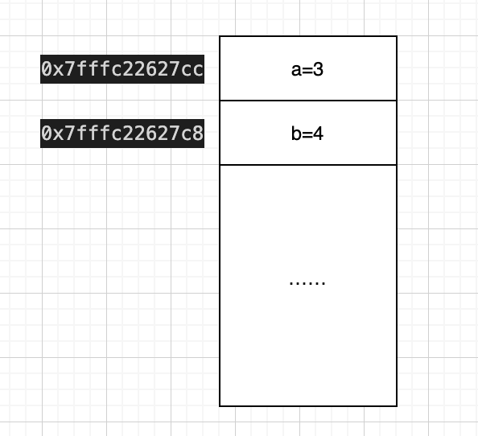
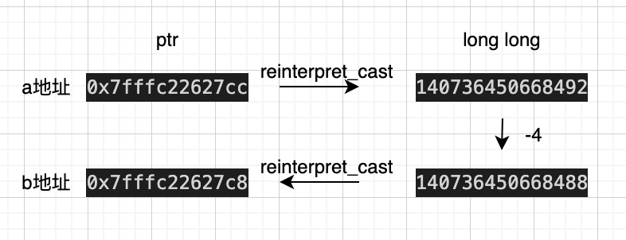

# reinterpret_cast
这个官方解释是**通过重新解释底层位模式在类型间转换。**  
说的有点玄学，并且在 reinterpret_cast 真实场景中使用情况很少，我们先用一段代码一步步的了解学习:   
```
int main(int argc, char* argv[]) {
    // 1 阶段
    int a = 3;
    int b = 4;

    printf("b ptr: %p \n", &b);

    // 2 阶段
    int* t1 = &a;
    long long t2 = reinterpret_cast<long long>(t1);
    t2 -= 4;
    *reinterpret_cast<int*>(t2) = 10;

    printf("reinterpret_cast<int*>: %p\n", reinterpret_cast<int*>(t2));
    printf("b: %d\n", b);
    return 0;
}

// 输出结果
b ptr: 0x7fffc22627c8 
reinterpret_cast<int*>: 0x7fffc22627c8
b: 10
```
1. 首先申明了两个 int 的变量在栈中，此时我们内存结构中如下图   
  
*(注意: 这里需要 printf 一下 b 的地址，否则编辑器会进行一些优化，导致结果和预期不同……)*

2. 这里先获取了 a 的地址，然后将地址转为了一个 long long 类型，这里就用到了我们的主角 reinterpret_cast，它意味着我们就把括号内的表达式（代码中是t1），不管不顾的解析为类型（long long），这里记得保证不要溢出。  
然后我们将 t2 - 4，再使用 reinterpret_cast，也就是直接将 t2 这个 long long 不管不顾的解析为地址。  
用图来表示就是如下图:  
  

最后结合输出就理解了 reinterpret 的作用。  

了解了一下用法，我们不难发现，他的使用场景真的很少，而且风险非常的高，可谓是 reinterpret_cast 大胆用，Segmentation fault 永相随。  

[https://zh.cppreference.com/w/cpp/language/reinterpret_cast](https://zh.cppreference.com/w/cpp/language/reinterpret_cast) 里介绍了一些用法，但也都是有点强行使用的味道，不过《Effective C++》里面描述了一种用法:  
> 针对原始内存（raw memory）写出一个调试用的分配器。  
其实就是针对自定义的 operator new 和 operator delete 通过 reinterpret_cast 转换 ptr 和 int 类型计算偏移增加一个签名，检测内存合法性。

最终的建议还是能不用就别用。

