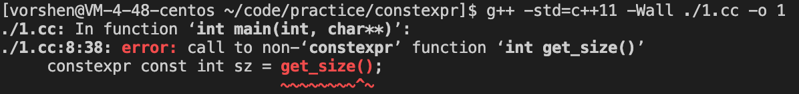
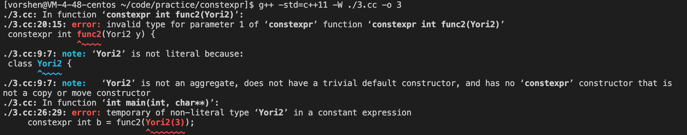

# constexpr

## constexpr 基础类型
总结一下关于 C++ 中的 constexpr  
这个字面上看应该翻译为常量表达式，C++ Primer 书中给常量表达式的定义是:  
「值不会改变并且在编译过程中就能得到计算结果的表达式」  
```
const int max_files = 20; // ✅
const int limit = max_files + 1; // ✅
int staff_size = 27; // ❌ 值可能会改变
const int sz = get_size(); // ❌ 无法在编译过程中就得到计算结果
```
针对后面两种情况，如果我们增加 constexpr 会有什么样的效果呢？  
先看场景3
```
int main(int argc, char* argv[]) {
    constexpr int staff_size = 27;
    printf("%d\n", staff_size);

    return 0;
}
```
并没有报错，因为这里显性将 staff_size 声明为常量表达式，staff_size 也自带了 const 属性  

再看场景4  
```
int get_size() {
    return 233;
}

int main(int argc, char* argv[]) {
    constexpr const int sz = get_size();
    printf("%d\n", sz);

    return 0;
}
```
编译报错了，如下图  
  
说 get_size 不是一个 constexpr 函数。虽然我们肉眼看可以明确知道 get_size 一定是返回一个字面量，可以在编译阶段就确定结果，但是编译器无法保证，此时就需要我们**给 get_size 增加一个 constexpr 修饰符。**
```
constexpr int get_size() {
    return 233;
}
```
如上就可以了  

## constexpr 函数
那哪些函数可以增加 constexpr 修饰符呢？  
1. 无逻辑，直接返回常量表达式的
2. 常量表达式进行了一些操作
3. 虽然函数内部是变量，但是只有常量表达式调用的  
1，2很好理解，pass，重点看一下3，如下代码  
```
constexpr int func(int t) {
    return t * t;
}

int main(int argc, char* argv[]) {
    printf("%d\n", func(2));
    printf("%d\n", func(argc));

    constexpr int a = func(2);
    constexpr int b = func(argc); // ❗编译报错
    int i = 5;
    constexpr int c = func(i); // ❗编译报错，如果上一行是 const int i = 5 则没问题

    return 0;
}
```
报错表明了声明了 constexpr 的函数，它的参数必须是常量表达式，**哪怕参数并没有用到**，比如如下:  
```
constexpr int func(int t) {
    return 2;
}
```
这个函数没有用到参数，但是调用的地方，参数也必须是常量表达式  

## constexpr 类
上一节我们知道了 constexpr 函数的参数和返回值都必须是常量表达式，那一定得是基础类型么？可不可以是 class 呢？我们用如下代码来试一下  
```
#include <stdio.h>

class Yori1 {
public:
private:
    int t = 10;
};

class Yori2 {
public:
    Yori2(int t): t(t) {}
private:
    int t;
};

constexpr int func1(Yori1 y) {
    return 2;
}

constexpr int func2(Yori2 y) {
    return 3;
}

int main(int argc, char* argv[]) {
    constexpr int a = func1(Yori1());
    constexpr int b = func2(Yori2(3));
    return 0;
}
```
下面是编译结果  
  
可以看到 Yori1 被认为是一个 constexpr，虽然它全程没有 constexpr 关键字。也能理解，毕竟它完全是一个数据类。  
Yori2 就不行了，出现了报错。其实核心在于 Yori2 的构造函数并不算是一个 constexpr 函数，所以我们只需要给构造函数加上 constexpr 关键字即可，如下:  
```
class Yori2 {
public:
    constexpr Yori2(int t): t(t) {}
private:
    int t;
};
```
这样只要初始化 Yori2 的时候，传入的构造函数参数本身是一个常量表达式，生成的实例，也可以当作常量表达式，🛫️  