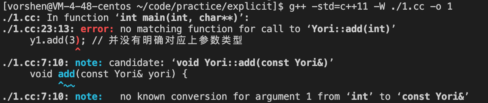
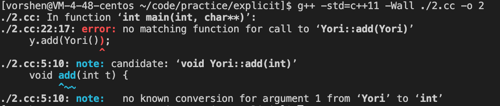

# explicit
explicit 是 C++11 新增的特性，这个关键字主要出现在函数的前面，英文直译是「显性的、明确的」，真实作用和直译也是完全一样。  

有明确的，当然也有不明确的，或者说含糊其辞的，在代码中主要指的是类型的不明确，比如下:
```
class Yori {
public:
    Yori(int val): val_(val) {}

    void add(const Yori& yori) {
        val_ += yori.val();
    }

    inline int val() const {
        return val_;
    }
private:
    int val_;
};

int main(int argc, char* argv[]) {
    Yori y1(2);
    Yori y2(3);

    y1.add(y2); // 明确对应上了参数类型
    y1.add(3); // 并没有明确对应上参数类型

    printf("%d\n", y1.val());

    return 0;
}
```
可以看到，这里第一次调用，参数类型是匹配的。但是第二次调用，只传入了一个 int 类型，也可以正常执行，因为编译器帮我们进行了隐式的类型转换，执行了 Yori 的构造函数，所以此时我们只需要给 Yori 的构造函数上加上 explicit 修饰符，就会编译报错。
```
class Yori {
public:
    explicit Yori(int val): val_(val) {} // 增加了 explicit
```
编译报错如下  
  

explicit 不仅仅可以用在构造函数上，还可以用在**类的类型转换函数上**  
_类的普通函数无法使用_  
```
class Yori {
public:
    void add(int t) {
        val_ += t;
    }

    inline int val() const {
        return val_;
    }

    operator int() {
        return val_;
    }
private:
    int val_ = 1;
};

int main(int argc, char* argv[]) {
    Yori y;
    y.add(Yori()); // Yori() 当作参数的时候，会执行类型转换函数，转为 int

    return 0;
}
```
此时是正常的，如果我们增加 explicit 就不行了  
```
#include <stdio.h>

class Yori {
public:
    void add(int t) {
        val_ += t;
    }

    inline int val() const {
        return val_;
    }

    explicit operator int() {
        return val_;
    }
private:
    int val_ = 1;
};

int main(int argc, char* argv[]) {
    Yori y;
    y.add(Yori()); // 编译报错
    y.add(static_cast<int>(Yori())); // 显式强制类型转换可以

    return 0;
}
```
这样则会编译报错，报错如下:  
  

不过有一个特殊点需要注意的，就是当满足
1. 转换类型为 bool 时
2. 在条件语句中（if else，for 循环条件）  
可以不用显式的类型转换，如下:  
```
class Yori {
public:
    explicit operator bool() {
        return val_ > 0;
    }
private:
    int val_ = 1;
};

int main(int argc, char* argv[]) {
    Yori y;

    if (Yori()) {
        printf("正常执行\n");
    }

    return 0;
}
```

总结：其实就是注意，class 构造函数有 explicit 修饰符，并不是要求该 class 构造函数的参数明确，而且**要求使用该 class 前必须进行明确的构造**。