# 重学 HashTable
HashTable，又称散列表，一说到这个，可能很多人第一反应就是时间复杂度O(1)！再深入一点的同学又会知道，当 hash 冲突较多的时候时间复杂度又会退化到O(n)。所以其实 HashTable 还是有很多细节的，这片文章就带大家梳理一下 HashTable 的细节，最后一起拜读一下 v8 和 redis 的 HashTable 相关源码。

## 目录
### HashTable 原理
### HashTable 问题与解决
### v8 中的 HashTable
### redis 中的 HashTable

## HashTable 原理
先看一段代码
```
map<string, string> yori;
yori["interest"] = "drink";

cout << yori["interest"] << endl;
```
这段代码基本上入门的程序员也能看得懂，但是仔细思考了一下，有两个问题
1. 这里 drink 常量真正存到哪里去了
2. 为什么继续通过 interest 可以获取到刚刚存起来的 value

如果这两个问题你很明确答案，那么可以直接跳到下一节，节省时间，互联网讲究敏捷

针对刚刚这两个问题，我们换个思路，我们用数组这种更底层的数据结构来实现上面代码的效果
```
    int keyToIndex(const string& key) {
        if (key === "yori") {
            return 0;
        }

        // other...
    }
    vector<string> yori;
    yori[keyToIndex("interest")] = "dirnk";

    cout << yori[keyToIndex("interest")]) << endl;
```
针对问题1，我们是将 drink 存到了一个数组里面去，索引是0
针对问题2，我们用一个函数，保证了 key 到数组索引是唯一的，所以第二次取的时候，也能找到索引0

这也就是 HashTable 的核心，可以用如下图来解释
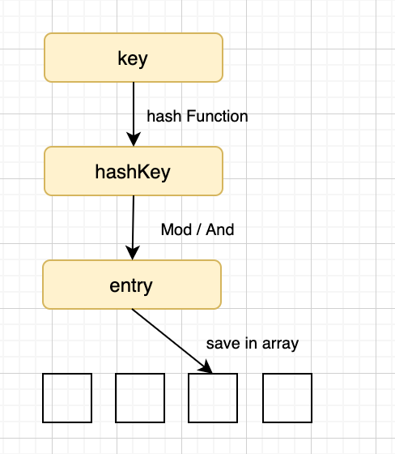
(*最简化的 hash 流程*)

我们来分析一下时间复杂度
在这里无论是 hash 函数，还是取余计算，乃至最后的数组寻址，都是时间复杂度为1
综合时间复杂度 O(1)，直接起飞🛫️

## HashTable 问题与解决
如果 HashTable 如此的简单，我也不会写这篇文章了。通过上一节，敏感的同学，心里可能有几个疑问，这里可能需要讨论的点有如下几个
1. 任何类型都能进行 hash 计算么？
2. 冲突了怎么办？

Q: **任何类型都能进行 hash 计算么？**
A: **如果你想用某个类型作为 hash table 的 key，那么它必须默认支持或者自定义支持 hash 函数**

以 C++ 的 unordered_map 为例，如果我们有一个自定义的数据结构，希望可以成为 hash 的 key，有如下办法
```
class Yori {
public:
    Yori(const string& liquor): liquor_(liquor) {};

    inline string liquor() const {
        return liquor_;
    }
private:
    string liquor_;
};

// 方案1 用一个类实现一个对应的 operator
class YoriHash {
public:
    std::size_t operator()(const Yori& yori) const {
        return std::hash<string>{}(yori.liquor());
    }
};

// 方案2 偏特化 std::hash 函数
namespace std {
template<>
    struct hash<Yori> {
        size_t operator()(const Yori& yori) const noexcept {
            return std::hash<string>{}(yori.liquor());
        }
    };
} // std

int main(int argc, char* argv[]) {
    unordered_map<Yori, int, YoriHash> m2; // 使用方案1
    unordered_map<Yori, int> m1; // 使用方案2

    return 0;
}
```
这里本质上，对 Yori 求 hash，变成了对 Yori 下的 liquor 这个属性求 hash，那么 string 类型为什么能直接到 size_t 类型呢？这是因为 gcc 等编译器已经将这些标准库类型提前做好偏特化了，截取部分代码如下
```
    // basic_string.h
    #if __cplusplus >= 201103L

    #include <bits/functional_hash.h>

    namespace std _GLIBCXX_VISIBILITY(default)
    {
    _GLIBCXX_BEGIN_NAMESPACE_VERSION

      // DR 1182.

    #ifndef _GLIBCXX_COMPATIBILITY_CXX0X
      /// std::hash specialization for string.
      template<>
        struct hash<string>
        : public __hash_base<size_t, string>
        {
          size_t
          operator()(const string& __s) const noexcept
          { return std::_Hash_impl::hash(__s.data(), __s.length()); } // 通用 hash 计算，感兴趣可以自行了解
        };
        // ......
```

小伙伴可能会有疑问，javascript，在 ES6 中，有 Map 的这样新的数据结构，是支持任何类型作为 key 的。因为 v8 已经支持好了数字、string、symbol、地址这些 hash 计算了，可谓是代码放心飞，v8 永相随。
```
// The Name abstract class captures anything that can be used as a property
// name, i.e., strings and symbols.  All names store a hash value.
class Name : public TorqueGeneratedName<Name, PrimitiveHeapObject> {
```
v8下name.h 的注释，可以看到**All names store a hash value.**。

这样我们第一个问题基本解决清楚了，更深的细节比如*gcc 提供的通用 hash 能力*、*如何尽可能避免 hash 碰撞等*，可以自行了解。

Q: **冲突了怎么办**
从之前的流程可以看到，存在两个阶段可以冲突
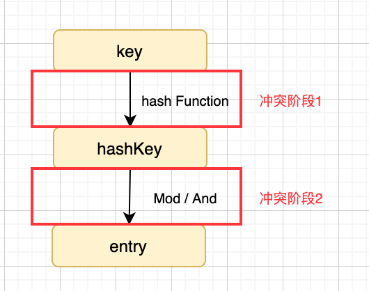
(*两个阶段可能冲突*)

对于第一阶段，因为 hash 的过程是将一个无限的空间映射到一个有限的空间里，比如我们熟知的 md5 算法，在网上搜索也会有碰撞的🌰。不过总的来说，这种几率还是较小的，用户在正常使用中，一般还是较难遇到碰撞的情况。

对于第二阶段，取余的冲突可能性就太大了，当数组长度过小时概率不要太大。我们也不能无脑将数组长度设置的很大，很可能会造成空间浪费的情况。这里有个名词叫做 **loadFactor(装载因子)** 来表示冲突的情况
```
loadFactor = 当前元素数量 / 数组长度
```
装载因子越大，意味着冲突概率越大，那么当装载因子是1的时候，是不是必冲突呢？如果你能清晰的给出答案，那可以直接跳到第三节。

那遇到碰撞了应该怎么办呢？
A: **对于冲突的情况，已经有了成熟的解决方案，主要方案有如下两种**
1. 开放寻址法
2. 链表法

### 开放寻址法
我们用下面这个图来讲解
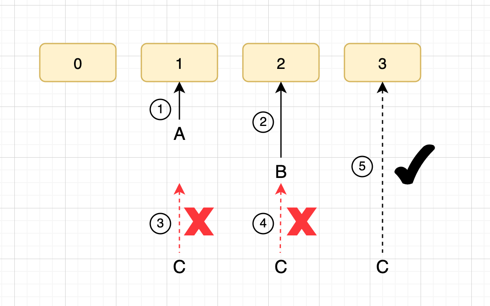
(*开放寻址法插入元素*)
1⃣ A元素计算出 entry=1，对应位空，插入到数组中
2⃣ B元素计算出 entry=2，对应位空，插入到数组中
3⃣ C元素计算出 entry=1，对应位存在，无法插入，往后寻找
4⃣ 往后寻找到 entry=2，对应位存在，无法插入，继续往后寻找
5⃣ 往后寻找到 entry=3，对应位空，插入到数组中

查找的过程也是类似的，以查找C元素为例
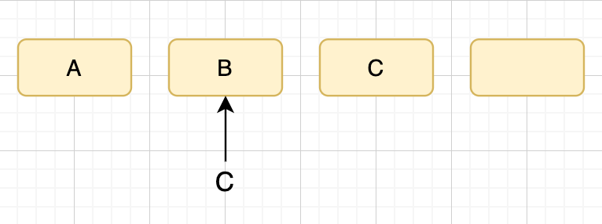
(*开放寻址法查找元素*)
1⃣ 计算出 entry=1，不匹配，往后寻找
2⃣ 往后寻找到 entry=2，不匹配，继续往后寻找
3⃣ 往后寻找到 entry=3，匹配，返回

这里有几个问题
1. 数组长度不够了怎么办
*当装载因子变成1的时候，无论怎么寻址，对应位非空，空间已经不够用了。那时候我们就得重新申请更长的数组长度，这个过程一般称为 rehash*。

2. 一直查找不到的情况下，会不会死循环
*不会死循环，当寻找到空位置或者原点的时候，就认为不在表中*。

3. 如何确保不会取错
*因为 entry 甚至 hashKey 都可能存在冲突，所以切记不能只存一个 value。key(原始 key，因为 hashKey 可能已经冲突了)也需要存，比对的时候需要比对 key*。

4. 删除导致的空，会影响寻址的地址，这里用个图举例
![插入C]](./assets/3-2.png)
首先插入C，但是发现 entry=1 存在，所以真实放到了 entry=2

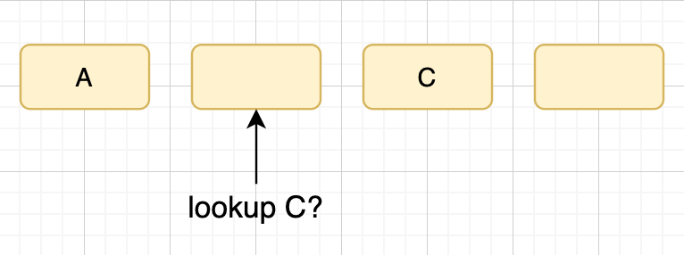
删除了B，如果就直接将 entry=1 清空

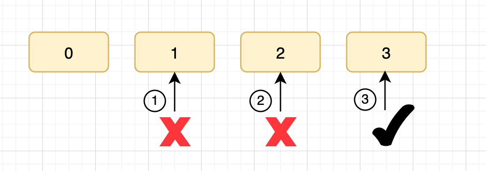
此时再查找C，hash 之后发现 entry=1 为空，那就认为C不在表中，打出GG
所以对于开放寻址法，**删除导致的空和真正的空是要区分的**。
```
// HashTable is a subclass of FixedArray that implements a hash table
// that uses open addressing and quadratic probing.
//
// In order for the quadratic probing to work, elements that have not
// yet been used and elements that have been deleted are
// distinguished.  Probing continues when deleted elements are
// encountered and stops when unused elements are encountered.
//
// - Elements with key == undefined have not been used yet.
// - Elements with key == the_hole have been deleted.
```
v8 的 HashTable 的开头注释。

### 链表法
先用图来讲解下
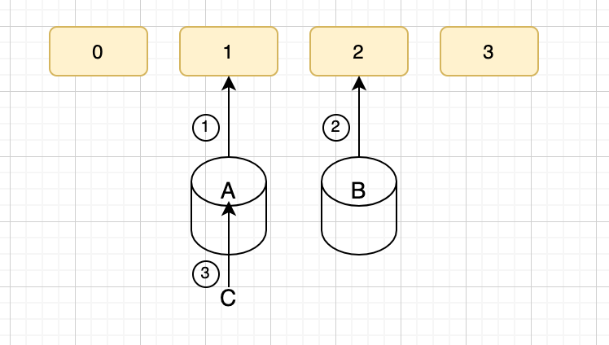
(*链表法查找元素*)
0⃣ 首先这里增加了一个桶(bucket)的概念，数组里面每一位是一个桶(链表)，不再直接存 key-value
1⃣ A元素计算出 entry=1，将其放入到对应的桶中
2⃣ B元素计算出 entry=2，将其放入到对应的桶中
3⃣ C元素计算出 entry=1，继续将其放入到对应的桶中（链表长度为2）

查找的过程就不画图了，一句话概括就是：**先查找数组索引，再遍历链表**

我们对比一下开放寻址法，似乎链表法更优势，因为它不存在「数组长度不够」的问题。但是，**rehash 仍然会进行！！**因为用 HashTable 是为了它迷人的 O(1) 时间复杂度，当装载因子大于1的时候，**虽然链表法下不一定冲突**，但是后续的插入、查找操作都有大概率变成在链表上进行，时间复杂度降为 O(n)，这和我们初衷背道而驰了。

redis 中就是采取的链表法，v8 中也有部分采用了，后面细说。还有一些其他的解决方案这里就不展开了，感兴趣的同学可以自行了解。

## v8 中的 HashTable
刚刚提到了，v8 中的 HashTable 有使用开放寻址法的，也有使用链表法的，我们先讲一下开放寻址法相关的使用。

### v8 中的开放寻址法
因为平时在写 js 的过程中，大部分开发很少关注 v8 内部的实现，所以如果直接切入 v8，可能会有点懵逼，所以我们还是先用 js 来引入一个问题，先看如下这段代码：
```
const yori = new Array(1000);
const yussica = new Array(1001);
```
上面代码就是定义了两个空数组，长度分别是 1000 和 1001，此时我们看一下内存的情况
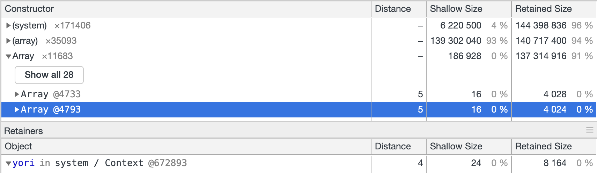
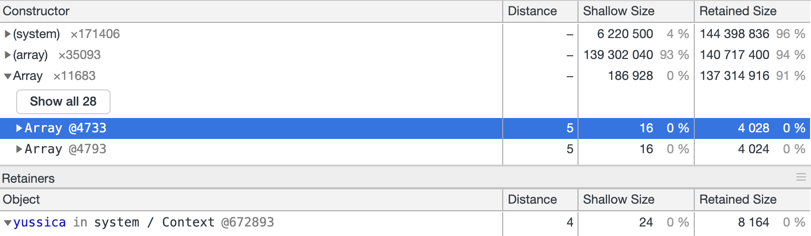

可以看到 length 多的那个数组，大小大了 4b，读者也可以自行修改长度，发现规律就是 length+1 = 4b。然鹅，当数组长度大到一定大小之后就不生效了！！

```
const yori = new Array(33554432);
const yussica = new Array(33554433);
```
内存结构变成了这样
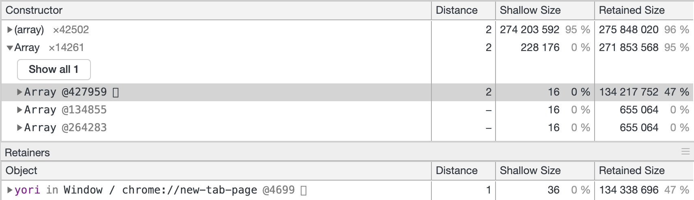
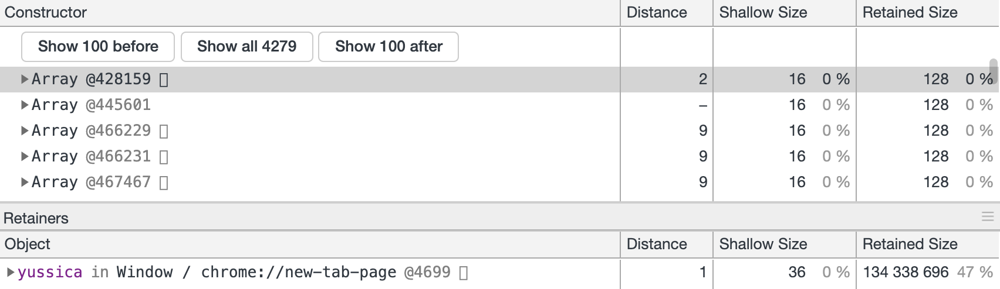

可以看到 yori 数组还是很大，基本上还是满足刚刚的规律的。但是！yussica 数组占用空间变得很小了，不过使用起来并没有感觉到什么差异，这是为什么呢？

因为当数组长度超过 32 * 1024 * 1024 时，JSArray 的内部实现，会由 FastElement 模式（FixArray 实现），变成 SlowElement 模式（HashTable 实现）
下面是 v8 对 JSArray 的注释
```
// The JSArray describes JavaScript Arrays
//  Such an array can be in one of two modes:
//    - fast, backing storage is a FixedArray and length <= elements.length();
//       Please note: push and pop can be used to grow and shrink the array.
//    - slow, backing storage is a HashTable with numbers as keys.
```

FastElement 模式我们不讨论，主要看 SlowElement 模式。我在 v8 中增加了一些关键节点的 log，然后我们执行一段 js 代码，看一下 v8 干了什么
```
console.log('Start');

const yussica = [];
yussica.length = 111111111;
yussica[0] = 0;
yussica[1] = 1;
yussica[2] = 2;

console.log('End');
```
代码很简单，肯定看的懂，下面看 log 情况

```
Start
[v8][JSArray::SetLength], prepare, new_length: 111111111 
[v8][JSArray::SetLengthWouldNormalize], 当前 FastElement, 判断是否需要转换为 SlowElement
[v8][JSArray::SetLengthWouldNormalize], new_length(111111111) > kMaxFastArrayLength(33554432) 
[v8][ShouldConvertToSlowElements], old_capacity: 0, new_capacity: 0 
[v8][JSArray::SetLength], 转换成 FastElement, Capacity: 4 
[v8][JSArray::SetLength], done 

[v8][JSObject::AddDataElement], index: 0 
[v8][DictionaryElementsAccessor::AddImpl], 使用了 DictionaryElementsAccessor 添加元素 
[v8][Dictionary::Add], 计算出 hash: 993088831 
[v8][HashTable::EnsureCapacity], 空间足够 
[v8][Dictionary::Add], 计算出 entry: 3 

[v8][JSObject::AddDataElement], index: 1 
[v8][DictionaryElementsAccessor::AddImpl], 使用了 DictionaryElementsAccessor 添加元素 
[v8][Dictionary::Add], 计算出 hash: 732518952 
[v8][HashTable::EnsureCapacity], 空间足够 
[v8][Dictionary::Add], 计算出 entry: 0 

[v8][JSObject::AddDataElement], index: 2 
[v8][DictionaryElementsAccessor::AddImpl], 使用了 DictionaryElementsAccessor 添加元素 
[v8][Dictionary::Add], 计算出 hash: 742761112 
[v8][HashTable::EnsureCapacity], 空间足够 
[v8][Dictionary::Add], 计算出 entry: 1 
End
```
*这里标注出了内部的方法名，感兴趣的同学可以自行查阅路径*
因为 v8 继承非常的多，代码跳跃性太强，从上面可以看到又是 JSObject、又是 Dictionary、又是 HashTable 的。如果想把这里完全讲清楚，一篇文章远远不够，所以这里给一个缩减版的 UML 图，只涉及到数组的一个 push 操作所用到的。
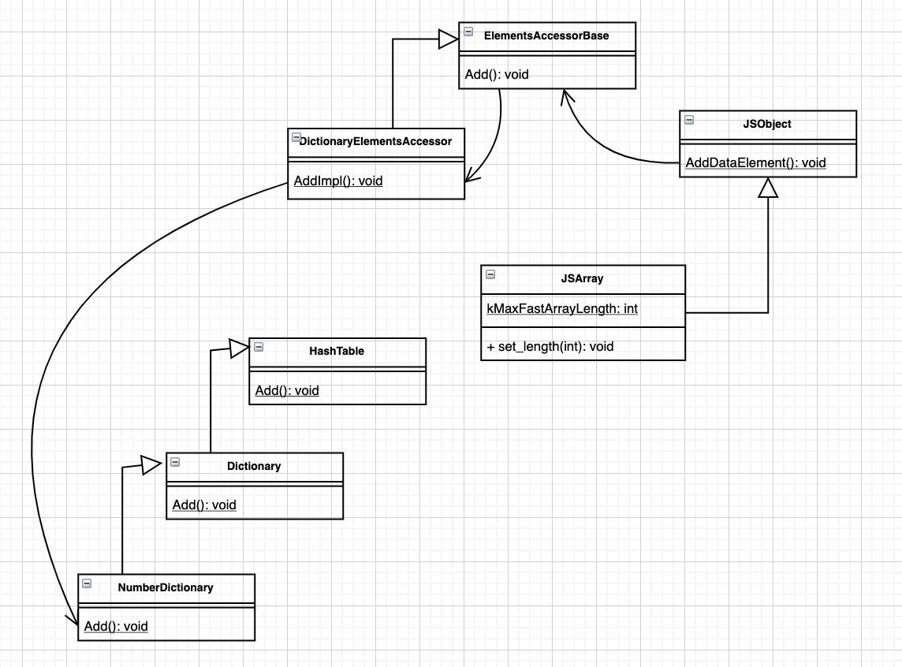

本身调用的入口在 JSObject 上，而 JSObject 可能是多种类型，所以这里通过 Kind 找到了对应的 Accessor(DictionaryElementsAccessor)，再去走到 NumberDictionary 去 Add。NumberDictionary 就是 HashTable 的派生类之一。

然后关于 HashTable 内部的内存分布这里也给一下，直接看代码容易绕晕，对照着图看就会清晰一下。
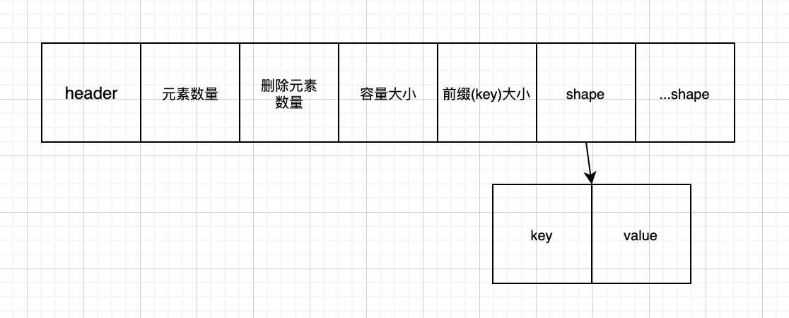

其实理清了类之间的关系（**或者只关心流程，不要在乎在哪调用的**），这里添加元素的流程和之前说的一致
1. 传入 key-value，这里 key 就是数组索引，分别对应 0、1、2
2. 计算 hashKey，结果分别是 993088831、732518952、742761112
3. 计算 entry，结果分别是 3、0、1
**这里注意了！在 Capacity 为 4 的情况下，直接和 Mask 与运算得到的结果是如下的**
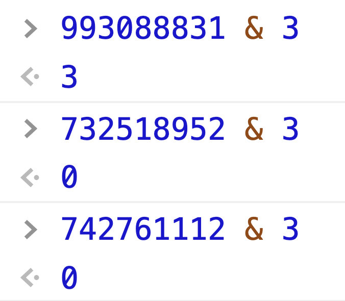
所以 index:742761112 最终到 entry:1 就是开放寻址法起到了作用，核心具体代码如下
```
template <typename Derived, typename Shape>
InternalIndex HashTable<Derived, Shape>::FindInsertionEntry(IsolateRoot isolate,
                                                            ReadOnlyRoots roots,
                                                            uint32_t hash) {
  uint32_t capacity = Capacity();
  uint32_t count = 1;
  // EnsureCapacity will guarantee the hash table is never full.
  for (InternalIndex entry = FirstProbe(hash, capacity);;
       entry = NextProbe(entry, count++, capacity)) {
    if (!IsKey(roots, KeyAt(isolate, entry))) return entry;
  }
}
```
不要管模版和其他，只关注 for 循环，这里有两次查询
```
inline static InternalIndex FirstProbe(uint32_t hash, uint32_t size) {
  return InternalIndex(hash & (size - 1));
}

inline static InternalIndex NextProbe(InternalIndex last, uint32_t number,
                                    uint32_t size) {
  return InternalIndex((last.as_uint32() + number) & (size - 1));
}
```
其中 FirstProbe 很好理解，找到第一次 entry 可能的位置，如果发现位置已经有 key 了，那么就循环执行 NextProbe。前面我们相当于通过 ++ 来执行 NextProbe 的，v8 这里步长会增大。v8 丝毫不担心出现死循环，因为这一行注释说的很清楚
*EnsureCapacity will guarantee the hash table is never full.*

EnsureCapacity 就是通过 rehash 来保证的，具体怎么做的我们研究一下，再回到 js 代码

```
console.log('Start');

const yussica = [];
yussica.length = 111111111;
yussica[0] = 0;
yussica[1] = 1;
yussica[2] = 2;
yussica[3] = 3; // 新增一行

console.log('End');
```
我们新增了一行，会发生什么呢？
```
……略
[v8][JSObject::AddDataElement], index: 3 
[v8][DictionaryElementsAccessor::AddImpl], 使用了 DictionaryElementsAccessor 添加元素 
[v8][Dictionary::Add], 计算出 hash: 509378648 
[v8][HashTable::EnsureCapacity], 空间不够 
[v8][HashTable::EnsureCapacity], new Capacity: 8 
[v8][HashTable::Rehash], 进行 Rehash 
[v8][HashTable::Rehash], old_entry(0), new_entry(1) 
[v8][HashTable::Rehash], old_entry(1), new_entry(3) 
[v8][HashTable::Rehash], old_entry(3), new_entry(4) 
[v8][Dictionary::Add], 计算出 entry: 6 
```
前面一些 log 我省略了，主要就是看一下空间不够的时候 v8 的处理。理解也挺好理解的，capacity=4 不够的时候，按2的倍数扩张，变成 8，然后 rehash。可以看到之前 entry 的位置发生了变化，从之前 0-3 的空间变化到了 0-7 的空间。

具体代码
```
template <typename Derived, typename Shape>
void HashTable<Derived, Shape>::Rehash(IsolateRoot isolate, Derived new_table) {
  DisallowGarbageCollection no_gc;
  WriteBarrierMode mode = new_table.GetWriteBarrierMode(no_gc);
  DCHECK_LT(NumberOfElements(), new_table.Capacity());

  // Copy prefix to new array.
  for (int i = kPrefixStartIndex; i < kElementsStartIndex; i++) {
    new_table.set(i, get(isolate, i), mode); // 1⃣
  }

  // Rehash the elements.
  ReadOnlyRoots roots = GetReadOnlyRoots(isolate);
  for (InternalIndex i : this->IterateEntries()) {
    uint32_t from_index = EntryToIndex(i);
    
    Object k = this->get(isolate, from_index);
    if (!IsKey(roots, k)) continue;
    uint32_t hash = Shape::HashForObject(roots, k);
    uint32_t insertion_index =
        EntryToIndex(new_table.FindInsertionEntry(isolate, roots, hash));
    new_table.set_key(insertion_index, get(isolate, from_index), mode); // 2⃣
    for (int j = 1; j < Shape::kEntrySize; j++) {
      new_table.set(insertion_index + j, get(isolate, from_index + j), mode); // 3⃣
    }
  }
  new_table.SetNumberOfElements(NumberOfElements());
  new_table.SetNumberOfDeletedElements(0);
}
```
看这段代码，核心就是标注出来的三个 set，可以结合之前发的 HashTable 内存结构图对照查看。
1⃣ 拷贝 前缀大小
2⃣ 拷贝 shape 中的 key
3⃣ 拷贝 shape 中的 value(按字节拷贝)

### v8 中的链表法
之前通过 js 超大数组，v8 将其转成了 NumberDictionary。NumberDictionary 底层是用开放寻址法实现的 HashTable，那什么是用链表法实现的 HashTable 呢？
我们不卖关子了，ES6 中的 Set 和 Map 就是用链表法实现的 HashTable，内部类是 OrderedHashTable。或许你已经对 *Ordered* 关键字开始疑惑了，不过不用担心，让我们一步一步分析。

很多语言都有 Map，比如 C++11 标准库就提供了 map 和 unordered_map，区别就是有无序。
```
int main(int argc, char* argv[]) {
    unordered_map<char, int> m1;
    m1.insert({'a', 1});
    m1.insert({'c', 3});
    m1.insert({'b', 2});

    for (auto t : m1) {
        cout << t.first << endl;
    }
    cout << "-----" << endl;

    map<char, int> m2;
    m2.insert({'a', 1});
    m2.insert({'c', 3});
    m2.insert({'b', 2});

    for (auto t : m2) {
        cout << t.first << endl;
    }

    return 0;
}
```
结果如图
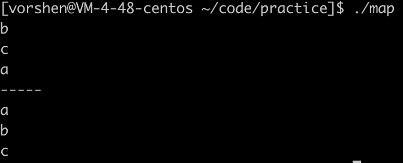
可以看到是按字典序排序的

那 js 中的 Map 有序么？在控制台执行发现很神奇的现象是有序的，但是和 C++ 中的 map 又不太一样，它不是按照字典序，而是按照插入的顺序
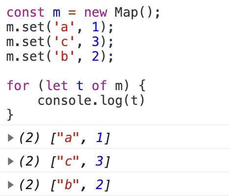

是不是很神奇，这里依靠的是特别的内存结构，这里给一下 OrderedHashTable 的内存分布图
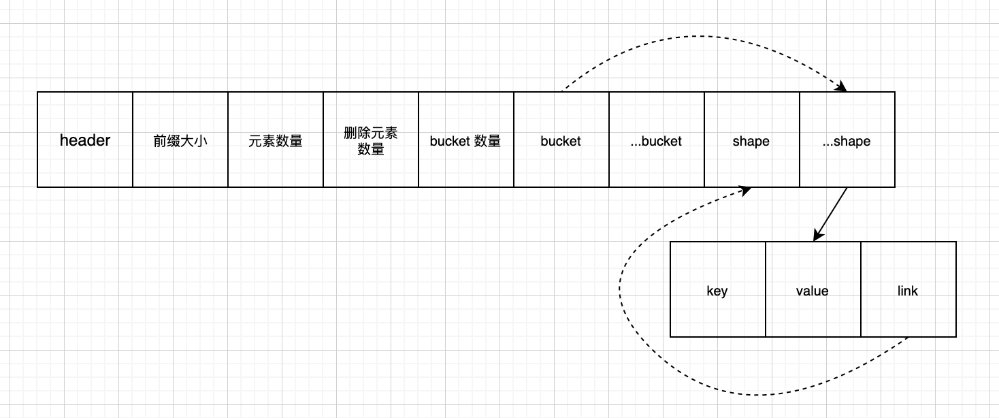
这里主要讲一下 bucket 和 shape
* buckets 的数量就是 hashkey 到 entry 的影响因素
* shape 又三个部分组成了，多了一个 link，**这个会链到前一个相同的 entry 的 shape**
这样一来，从前往后按顺序添加，遍历的顺序就是插入时的顺序，同时也是满足了 HashTable 碰撞时链表法的模型

我同样是加了一些 log，执行一段 js 看看
```
console.log('Start');

const yori = new Map();
yori.set('drinkA', '青岛');
yori.set('drinkB', '百威');
yori.set('drinkC', '科罗娜');
yori.set('drinkD', '乌苏');

console.log('End');
```

```
Start
[v8] Set Map, key(68194992), hash(1065593762), entry(0), capacity(2) 
[v8] Set Map, key(68195010), hash(290311991), entry(1), capacity(2) 
[v8] Set Map, key(68195028), hash(453829301), entry(1), capacity(2) 
[v8] Set Map, key(68195048), hash(749864448), entry(0), capacity(2)
End
```
*先给一个噩耗，v8 目前这里对 Map、Set 的写法有点乱。感兴趣看源码的同学可以直接看 js-collection.h，不建议跟执行流程，如果硬要跟，看 builtins-collections-gen.cc*
有了之前的经验，这个应该很好理解了，核心也是三部曲，key->hashKey->entry。特别一点的就是这里默认的 bucket 数量 是2。bucket 的数量是 capacity(初始值4) / 极限装载因子(2)。这里不像开放寻址法，entry 完全可以相同。
最核心的代码就是如下
```
void CollectionsBuiltinsAssembler::StoreOrderedHashMapNewEntry(
    const TNode<OrderedHashMap> table, const TNode<Object> key,
    const TNode<Object> value, const TNode<IntPtrT> hash,
    const TNode<IntPtrT> number_of_buckets, const TNode<IntPtrT> occupancy) {
  const TNode<IntPtrT> bucket = // 1⃣
      WordAnd(hash, IntPtrSub(number_of_buckets, IntPtrConstant(1)));
  TNode<Smi> bucket_entry = CAST(UnsafeLoadFixedArrayElement( // 2⃣
      table, bucket, OrderedHashMap::HashTableStartIndex() * kTaggedSize));

  // Store the entry elements.
  const TNode<IntPtrT> entry_start = IntPtrAdd( // 3⃣
      IntPtrMul(occupancy, IntPtrConstant(OrderedHashMap::kEntrySize)),
      number_of_buckets);

  UnsafeStoreFixedArrayElement(
      table, entry_start, key, UPDATE_WRITE_BARRIER,
      kTaggedSize * OrderedHashMap::HashTableStartIndex());
  UnsafeStoreFixedArrayElement(
      table, entry_start, value, UPDATE_WRITE_BARRIER,
      kTaggedSize * (OrderedHashMap::HashTableStartIndex() +
                     OrderedHashMap::kValueOffset));
  UnsafeStoreFixedArrayElement( // 4⃣
      table, entry_start, bucket_entry,
      kTaggedSize * (OrderedHashMap::HashTableStartIndex() +
                     OrderedHashMap::kChainOffset));

  // Update the bucket head.
  UnsafeStoreFixedArrayElement( // 5⃣
      table, bucket, SmiTag(occupancy),
      OrderedHashMap::HashTableStartIndex() * kTaggedSize);

  // Bump the elements count.
  const TNode<Smi> number_of_elements =
      CAST(LoadObjectField(table, OrderedHashMap::NumberOfElementsOffset()));
  StoreObjectFieldNoWriteBarrier(table,
                                 OrderedHashMap::NumberOfElementsOffset(),
                                 SmiAdd(number_of_elements, SmiConstant(1)));
}
```
重点的说一下
1⃣ 这个就是找到 entry
2⃣ 理解为生成新的 shape 节点
3⃣ 找到 shape 具体的位置(对照内存结构图)
4⃣ 设置 link(前面分别是设置 key 和 value)
5⃣ 更新 entry 上 bucket 最新的引用为新加进来的元素

rehash 的处理和 HashTable 区别不大，这里就不展开了。

## redis 中的 HashTable
redis 以快著称，它内部的 dict 类就是使用 HashTable 实现的。因为 redis 负责的事情更纯粹，所以代码也较好理解易读很多，我们就以源码解读的方式为主

需要注意的是：**redis 对外暴露的接口有一个就是 Hash，但是 Hash 内部实现是 ziplist + dict，数据量不大的时候使用 ziplist，数据量大了就采用 dict。所以下面我们看代码，直接用 Set 来讲解方便点（然鹅 Set 内部实现是 intSet + dict，所以跑 demo 的时候需要用 string，不能是 int）**

首先是 redis 中和 dict 相关的几个比较重要的数据结构
1. dickType —— 通过自定义的方式，让 dict 可以支持任何数据结构的 key 和 value
```
typedef struct dictType {
    uint64_t (*hashFunction)(const void *key);
    void *(*keyDup)(void *privdata, const void *key);
    void *(*valDup)(void *privdata, const void *obj);
    int (*keyCompare)(void *privdata, const void *key1, const void *key2);
    void (*keyDestructor)(void *privdata, void *key);
    void (*valDestructor)(void *privdata, void *obj);
    int (*expandAllowed)(size_t moreMem, double usedRatio);
} dictType;
```
hashFunction 看名字+出入参应该就知道作用了
keyDup、valDup 发生拷贝操作时可以执行（一般是深拷贝），如果是 nullptr 就地址拷贝。具体可见 dict.h 中 dictSetKey、dictSetVal
keyCompare 用来比较两个 key，如果是 nullptr 就是直接地址比较。具体可见 dict.h 中 dictCompareKeys
keyDestructor、valDestructor 是定义了 key 、value 的析构函数。具体可见 dict.h 中 dictFreeKey、dictFreeVal
expandAllowed 当 dict 需要扩大时，是否允许，如果是 nullptr，默认允许。具体可见 dict.c 中 dictTypeExpandAllowed

可以看到，通过 dictType，可以实现自定义的 key、value 组合，下面就是一个🌰
```
/* Keylist hash table type has unencoded redis objects as keys and
 * lists as values. It's used for blocking operations (BLPOP) and to
 * map swapped keys to a list of clients waiting for this keys to be loaded. */
dictType keylistDictType = {
    dictObjHash,                /* hash function */
    NULL,                       /* key dup */
    NULL,                       /* val dup */
    dictObjKeyCompare,          /* key compare */
    dictObjectDestructor,       /* key destructor */
    dictListDestructor,         /* val destructor */
    NULL                        /* allow to expand */
};
```
这里的官方注释就已经写的很清楚了

2. dict
```
typedef struct dict {
    dictType *type;
    void *privdata;
    dictht ht[2];
    long rehashidx; /* rehashing not in progress if rehashidx == -1 */
    unsigned long iterators; /* number of iterators currently running */
} dict;
```
type 刚刚说过了
privdata 直译是私有数据，创建 dict 时传入，然后在调用上面说的那些 keyDup、valDup 等函数会传回
dictht 重点！dict hashTable，也是 dict 实现的核心，**注意，可以看到这里是个数组，长度为2，这是为了更优雅的增量 rehash，待会会看到精妙所在**
rehashidx 目前 rehash 的进度
iterators 迭代器，略

3. dictht —— dict 使用的 HashTable
```
typedef struct dictht {
    dictEntry **table;
    unsigned long size;
    unsigned long sizemask;
    unsigned long used;
} dictht;
```
table 之前说过 redis 的 hashTable 采取的是链表法，dictEntry 就是链表结构
size table 的长度
sizemask 计算 hashkey 到 entry 用的，恒等于 size-1。和上面说的 v8 做法一致
used 目前 hashTable 中已有的元素数量，可以与 size 计算出来 loadFactor

4. dictEntry —— 链表中每个节点的数据结构
```
typedef struct dictEntry {
    void *key;
    union {
        void *val;
        uint64_t u64;
        int64_t s64;
        double d;
    } v;
    struct dictEntry *next;
} dictEntry;
```
key 略
v value，这里使用了 union 来优化存储
next 略

数据结构看下来，其实还是挺简单的，至少对比 v8 的清晰明了太多。下面重点来说说 redis 的**增量 rehash**，这也是 redis 追求极致性能的一种体现

从前面 v8 分析中我们已经知道了 rehash 的目的是为了降低 loadFactor，让 hash 碰撞尽可能少。但是，一次 rehash 的成本可不低：
* 重新申请内存大小
* 迁移数据 —— 拷贝/移动成本、对所有 key 进行 hash 重算

redis 作为 server 端服务，追求的快速的响应时间，越快越好，但如果某次请求，命中了 rehash，那意味着会增大单个请求响应时间，这是不能接受的。
所以 redis 的做法，是将可能的单次较长的 rehash 时间，打散开，平均到每个请求中去，下面看具体的实现

我们如下的方式操作 redis
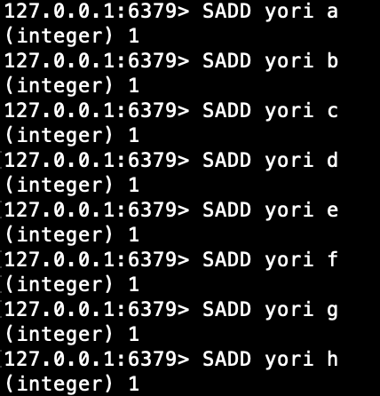

然后可以得到这样的结果，我整理一下
```
SADD yori a
[redis] saddCommand 
[redis] 不在进行 rehash 
[redis] value: a 
[redis] 开始进行 Rehash 
[redis] hashKey: 13728588299047492245 
[redis] entry: 1 
[redis] dict added, ht[0].size: 4, ht[0].used: 1
[redis] dict added, ht[1].size: 0, ht[1].used: 0

SADD yori b
[redis] saddCommand 
[redis] 不在进行 rehash 
[redis] value: b 
[redis] hashKey: 12257755146001261976 
[redis] entry: 0 
[redis] dict added, ht[0].size: 4, ht[0].used: 2
[redis] dict added, ht[1].size: 0, ht[1].used: 0

SADD yori c
[redis] saddCommand 
[redis] 不在进行 rehash 
[redis] value: c 
[redis] hashKey: 17574597941439108991 
[redis] entry: 3 
[redis] dict added, ht[0].size: 4, ht[0].used: 3
[redis] dict added, ht[1].size: 0, ht[1].used: 0

SADD yori d
[redis] saddCommand 
[redis] 不在进行 rehash 
[redis] value: d 
[redis] hashKey: 36062017759904132 
[redis] entry: 0 
[redis] dict added, ht[0].size: 4, ht[0].used: 4
[redis] dict added, ht[1].size: 0, ht[1].used: 0

SADD yori e
[redis] saddCommand 
[redis] 不在进行 rehash 
[redis] value: e 
[redis] 开始进行 Rehash 
[redis] hashKey: 3942771329094170746 
[redis] entry: 2 
[redis] dict added, ht[0].size: 4, ht[0].used: 4
[redis] dict added, ht[1].size: 8, ht[1].used: 1

SADD yori f
[redis] saddCommand 
[redis] 正在进行 rehash 
[redis] value: f 
[redis] hashKey: 15142165025344743775 
[redis] entry: 7 
[redis] dict added, ht[0].size: 4, ht[0].used: 2
[redis] dict added, ht[1].size: 8, ht[1].used: 4

SADD yori g
[redis] saddCommand 
[redis] 正在进行 rehash 
[redis] value: g 
[redis] hashKey: 1768894350167553498 
[redis] entry: 2 
[redis] dict added, ht[0].size: 4, ht[0].used: 1
[redis] dict added, ht[1].size: 8, ht[1].used: 6

SADD yori h
[redis] saddCommand 
[redis] 正在进行 rehash 
[redis] value: h 
[redis] hashKey: 5506351120338565809 
[redis] entry: 1 
[redis] dict added, ht[0].size: 8, ht[0].used: 8
[redis] dict added, ht[1].size: 0, ht[1].used: 0
```
我依然在源码中将关键节点的信息打了出来，然后先文字分析，再画图总结一下
前面 a,b,c,d 的设置没有什么好说的，还是之前的流程: key(这里直接用 value) -> hashKey -> entry。可以看到 12257755146001261976 & 3 = 0，36062017759904132 & 3 = 0，这里出现了两个相同的 entry，不过没关系，因为采用的是链表法。

核心代码如下
```
dictEntry *dictAddRaw(dict *d, void *key, dictEntry **existing)
{
    long index;
    dictEntry *entry;
    dictht *ht;

    if (dictIsRehashing(d)) _dictRehashStep(d);

    /* Get the index of the new element, or -1 if
     * the element already exists. */
    if ((index = _dictKeyIndex(d, key, dictHashKey(d,key), existing)) == -1) // 1⃣
        return NULL;

    /* Allocate the memory and store the new entry.
     * Insert the element in top, with the assumption that in a database
     * system it is more likely that recently added entries are accessed
     * more frequently. */
    ht = dictIsRehashing(d) ? &d->ht[1] : &d->ht[0]; // 2⃣
    entry = zmalloc(sizeof(*entry)); // 3⃣
    entry->next = ht->table[index]; // 4⃣
    ht->table[index] = entry; // 5⃣
    ht->used++;

    /* Set the hash entry fields. */
    dictSetKey(d, entry, key); // 6⃣
    return entry;
}
```
这里代码并不复杂，但是由于变量命名和我们前文中概念有点冲突，所以看起来可能有点乱
1⃣ 找到了一个 index(文中 entry 概念)，数组的位置(位置里每一个元素是一个链表 dictEntry)
2⃣ 找到对应的 HashTable，我们不在 Rehash 中，所以就是 ht[0]
3⃣ 生成一个新的链表节点
4⃣、5⃣ 将新的链表节点添加到链表的首位
6⃣ 将 key 保存到链表节点上

可以结合下面的图来看一下
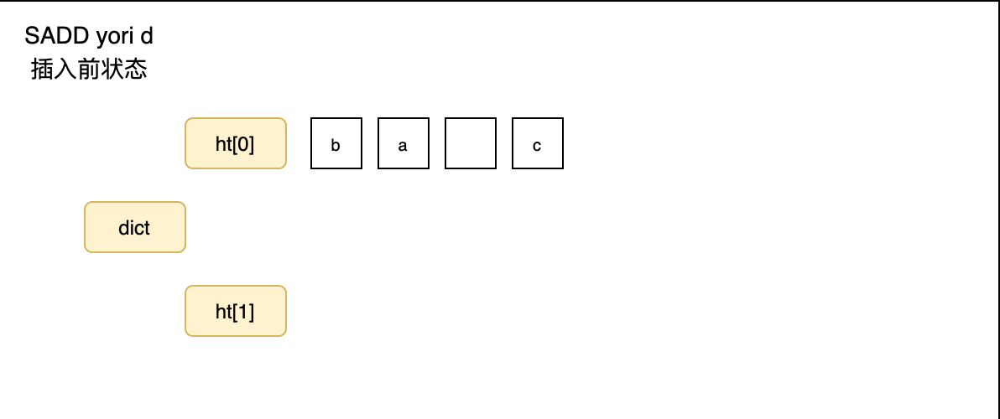
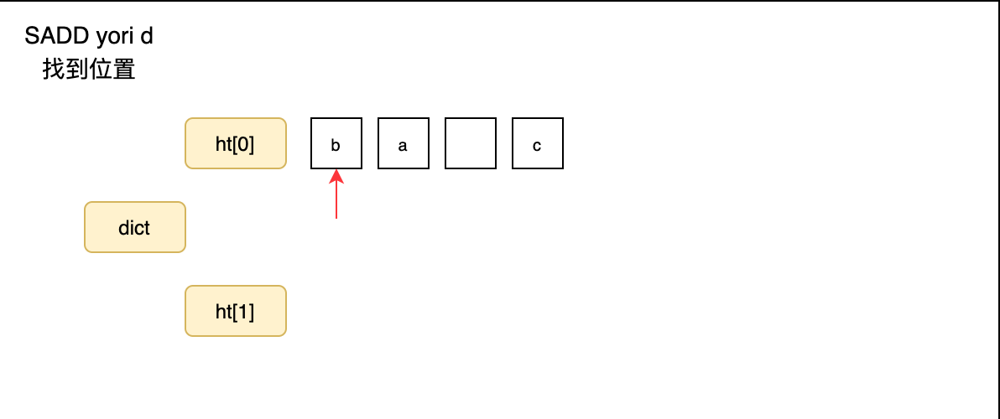
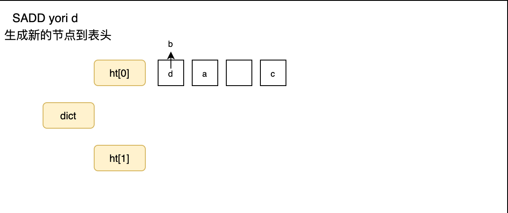

*之所以添加到表头，也是 redis 认为最近添加的元素，被访问到的几率大一些*

a,b,c,d 的设置讲清楚了，再看下面 e,f,g,h 的设置，这里涉及到增量 rehash 了，稍微复杂一些。我们先继续看图片流程，理解了流程，看代码就清晰了。
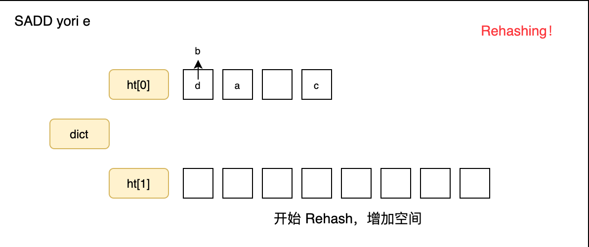
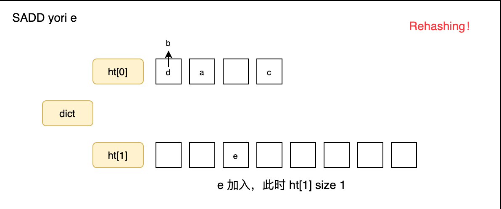
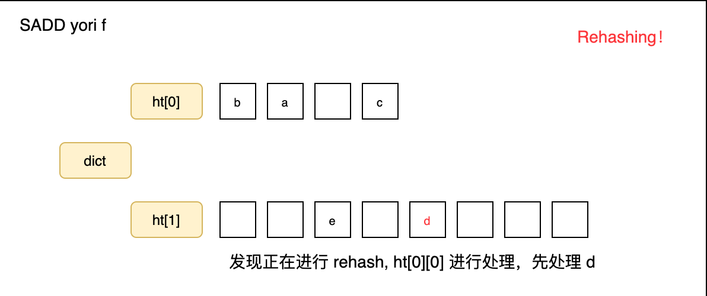
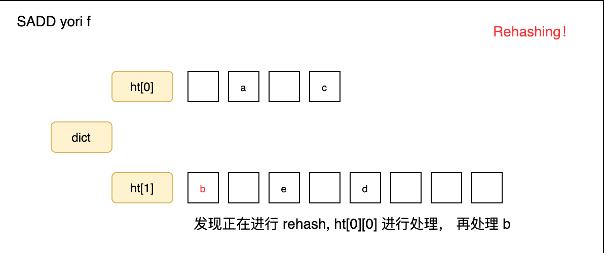
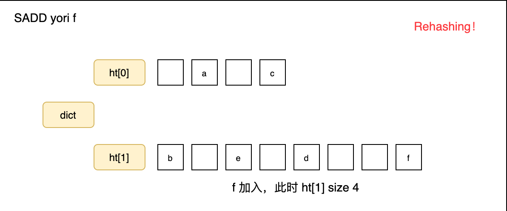
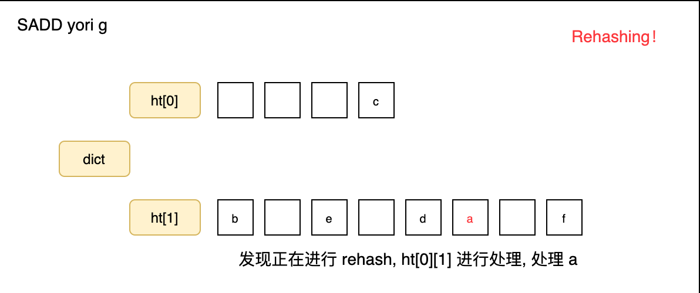
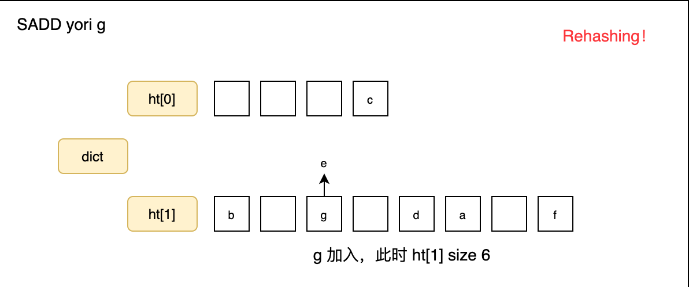
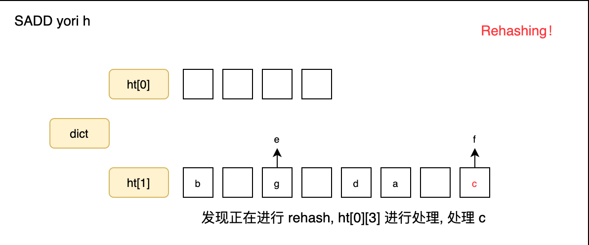
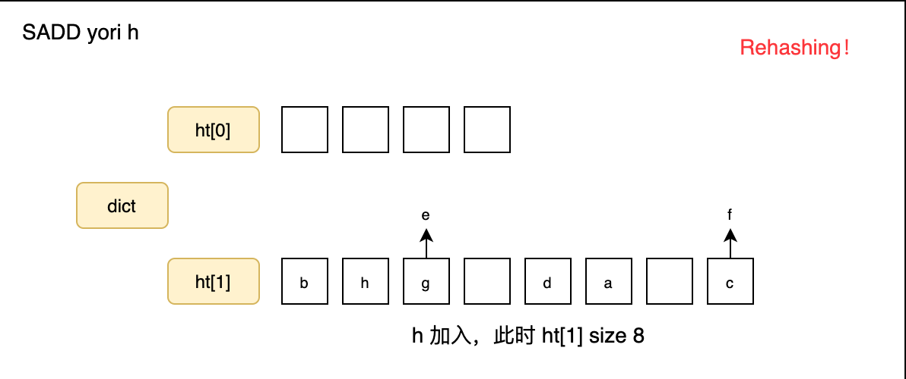
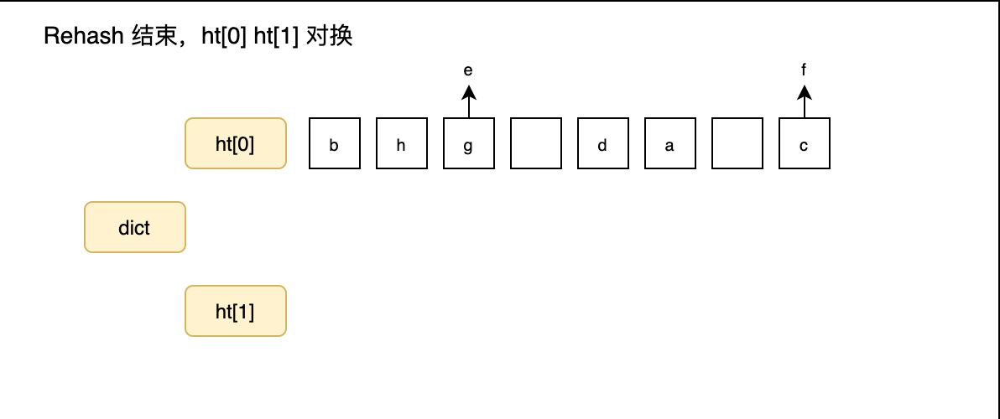

再贴一下 rehash 的核心代码
```
int dictRehash(dict *d, int n) {
    int empty_visits = n*10; /* Max number of empty buckets to visit. */
    if (!dictIsRehashing(d)) return 0;

    while(n-- && d->ht[0].used != 0) { // 1⃣
        dictEntry *de, *nextde;

        /* Note that rehashidx can't overflow as we are sure there are more
         * elements because ht[0].used != 0 */
        assert(d->ht[0].size > (unsigned long)d->rehashidx);
        while(d->ht[0].table[d->rehashidx] == NULL) { // 2⃣
            d->rehashidx++;
            if (--empty_visits == 0) return 1;
        }
        de = d->ht[0].table[d->rehashidx];
        /* Move all the keys in this bucket from the old to the new hash HT */
        while(de) { // 3⃣
            uint64_t h;

            nextde = de->next;
            /* Get the index in the new hash table */
            h = dictHashKey(d, de->key) & d->ht[1].sizemask;
            de->next = d->ht[1].table[h];
            d->ht[1].table[h] = de;
            d->ht[0].used--;
            d->ht[1].used++;
            de = nextde;
        }
        d->ht[0].table[d->rehashidx] = NULL;
        d->rehashidx++;
    }

    /* Check if we already rehashed the whole table... */
    if (d->ht[0].used == 0) { // 4⃣
        zfree(d->ht[0].table);
        d->ht[0] = d->ht[1];
        _dictReset(&d->ht[1]);
        d->rehashidx = -1;
        return 0;
    }

    /* More to rehash... */
    return 1;
}
```
这代码非常清晰，稍微说一下就行
1⃣ n 就是这次 rehash 推动的步数，默认是 1
2⃣ 遇到空桶(空链表)，就往后递增
3⃣ rehash，旧的桶转移到新的桶，跑完整个链表
4⃣ 检测 table[0] 是不是 rehash 结束了，如果结束了，就将 table[1] 赋给 table[0]

**注意：不仅仅是插入，当在 rehash 状态时，任何的操作，比如是 SISMEMBER 这种读操作，也会推动 rehash 的进度**，感兴趣的同学，可以自己再看看 dict 中其他接口的实现，都比较清晰，主要归功于 dict 内部所用的 HashTable 简单明了。

## 总结
我们从 HashTable 的原理入手，了解掌握了实现一个 HashTable 中的难题，最后一起看了一下 v8 和 redis 中 HashTable 相关的代码。总的来说 redis 的代码简单易懂一些，推荐入门同学先看 redis，当然直接啃 v8 也是可以滴。

时间仓促，一些细节可能会有偏差，如果有错欢迎斧正～
其他有问题的同学可以留言讨论～