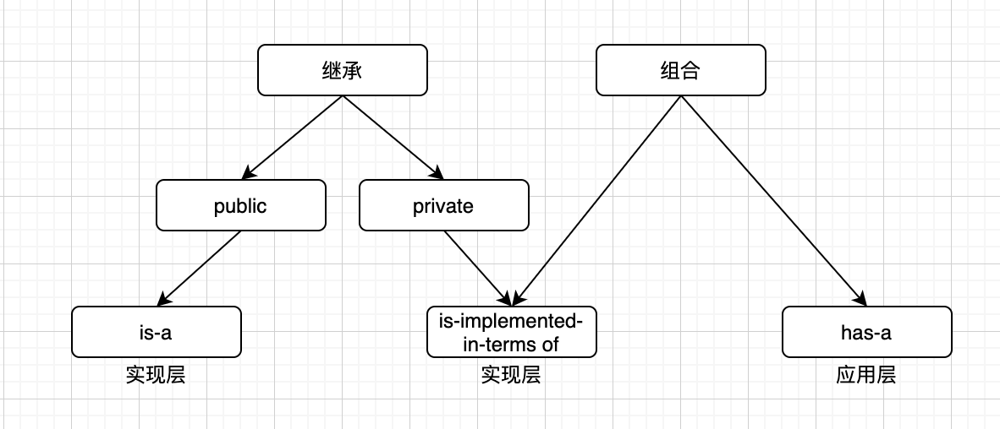

# inherit
继承基本是大部分语言都有的特性，这是面向对象编程中所必须的。面向对象这一编程范式也受到广大开发的喜爱，究其特点是，面向对象有着抽象现实化的特点，用一个个对象的属性、方法来描述出复杂的程序关系，并且方便抽象复用，易于扩展。  
这篇文章，我们就简单的来聊聊面向对象中的继承特点，主要是一些总结和自己的思考。

*语言主要为 C++，中途一些举例可能会用到 JS*。

# 前言
继承在面向对象中重要不重要？  
当然重要，这里网上搜一搜就有一大堆优点。但是我们可能还能看到类似如下的言论:  
>>> 使用继承是程序员入门的标志。
>>> 不使用继承是程序员成熟的标志。

这个说法还是有一定道理的，继承的问题在于太重了，一旦建立了继承关系，随之而来的便是逃脱不掉的依赖，新功能一旦发现某些场景下继承关系异常，要么推倒重来，要么淹没在茫茫中的兼容处理。  
更有某些语言（比如 javascript）不支持多继承，如果随便使用了继承这一重武器，其他该使用继承的地方就会变得无比艰难。

那么是不是就一定不要使用继承呢？那也不可能，否则这一特性就不会存在如此之久，存在便有其存在的理由。  
我们要做到的是: **合理的使用继承**。

如何合理的使用呢？我们从下面一些继承的特性说起。

# public/protected/private
注意，这里要说的并不是基类方法的修饰符（public 可以外界调用，protected 只能自己和派生类调用，private 只能自己调用）。三个方法修饰符实在是太简单了，所以我们直接省略。

**为了方便区分，下面如果是继承语义下，public、protected、private 继续使用英文**。  
**成员、方法中 public、protected、private 使用中文：公有、保护、私有**。

## public
public 继承的特点就是:  
- 公有成员、方法，继续保持为公有。
- 保护成员、方法，继续保持为保护。
- 私有成员、方法，继续保持为私有。

public 继承应该是使用最多的一种继承模式了，这可能也是大家认知中最标准的对应**继承**这一名次的使用。  
按《Effective C++》中的说法，public 继承是一种 is-a 的描述。  
*class D : public B*  
这意味着 D 是 B 的一种特例。B更通用化，而D更特殊化。

举例可以如下:
```
class Shape {
public:
    COLOR color;

    virtual ~Shape() = default;
    virtual void draw() = 0;
};

class Rect : public Shape {
public:
    void draw() {
        // ...
    }
};
```
Shape 是一种通用化的图形抽象描述，声明了 draw方法（*图形都拥有 draw 方法，这无可厚非*），而 Rect 是特殊化的图形，我们需要给它定义它自己的 draw 方法。  
认知清晰，是一种 is-a 的关系；满足里氏替换原则。可以初步说这是一种较好的继承使用。

再看两种不合适的例子:
1. 矩形与正方形
```
class Rect {
public:
    virtual ~Rect() = default;

    virtual void setWidth() {};
    virtual void setHeight() {};
    virtual int getWidth() {};
    virtual int getHeight() {};
};

class Square : public Rect {
public:
    void setWidth() {};
    void setHeight() {};
    int getWidth() {};
    int getHeight() {};
};
```
在我们现实生活中的认知里，正方形是一种特殊的矩形，以上我们将认知转换为了代码。  
但这种继承关系真的能满足里氏替换原则么？  
*任何使用矩形的地方，都可以用正方形代替吗？*  
**明显是不可以的**。

2. 事件
```
// node 官方 demo
const EventEmitter = require('events');

class MyEmitter extends EventEmitter {};

const myEmitter = new MyEmitter();
myEmitter.on('event', () => {
  console.log('an event occurred!');
});
myEmitter.emit('event');

// 不推荐写法
class Rect extends EventEmitter {
    draw() {
        // balabala...
        this.emit('draw');
    }
};

const rect = new Rect();
rect.on('draw', function() {
    // ...
});
```
这里用了事件举例，这种通用事件的方式一般有个基类，提供了监听、派发的方法。此时如果偷懒，可以让自己的 class 继承这个事件基类，用起来也没毛病，还挺方便。  
但是我们放空大脑思考一下，**矩形**和**事件**这两者是继承关系吗？**矩形**是一种特殊化的**事件**吗？程序中任何**事件**语义的地方，替换为**矩形**，还正常吗？  
由此可知，这并不是一种 is-a 的语义，并不推荐用继承的关系。

## protected
protected 继承的特点就是:  
- 公有成员、方法，变为保护。
- 保护成员、方法，继续保持为保护。
- 私有成员、方法，继续保持为私有。

protected 的话，按《Effective C++》的中说法，是一种没啥意义的继承方式。  
u1s1，确实。

## private
private 继承的特点就是:
- 公有成员、方法，变为私有。
- 保护成员、方法，变为私有。
- 私有成员、方法，继续保持为私有。

private 不像 protected，它还是有意义的。它的一个核心是将父类的公共方法不对外暴露，内部使用。

按《Effective C++》中标准说法，这是一种 is-implemented-in-terms of 的语义。光讲有点虚，我们举个🌰，用书中 Set 和链表的情况来说。  
如果我们不希望使用标准库中的 Set（平衡树实现），而是先用链表实现，那么我们可能有如下的写法:  
```
template<typename T>
class Set : public std::list<T> {
public:
    void insert(const T& elem) {
        std::list<T>::push_back(elem);
    }

    int size() {
        return std::list<T>::size();
    }
};

int main(int argc, char* argv[]) {
    Set<int> t;
    t.insert(3);
    t.insert(3);
    printf("size: %d\n", t.size());
    return 0;
}

// 输出结果:  
size: 2
```
通过结果可以看出这里的设计是有问题的，Set 应该含有去重。  
某些同学可能指出增加兼容的方案，比如在 insert 里面先判断是否存在，再决定调用基类的 push_back 或者直接 return。**但如果使用者直接调用 push_back 接口呢？**   
某些同学可能跳出实现本身，从宏观层面开始考虑，这里真的是 is-a 的语义么？在程序中我们将所有 list 的地方替换成 Set，语义上其实是有差异的，由此可知这并不应该是继承的关系。

那是什么？  
is-implemented-in-terms of，**Set 是由 list 实现的**。所以规范语义的写法，可以是这样:  
```
template<typename T>
class Set : private std::list<T> { // ⚠️ private 继承
public:
    void insert(const T& elem) {
        // 相应去重处理
        std::list<T>::push_back(elem);
    }

    int size() {
        return std::list<T>::size();
    }
};
```
*这里是使用了 private 继承的方案，关于组合和 private 继承的选择，后面会有一个小结专门提到。*  

# non-virtual/prue-virtual/impure-virtual
这一节是针对基类三种关于 virtual 的不同用法。

## non-virtual
意味着没有 virtual 关键字，这种给出的要求是:  
**派生类不要进行任何 override。**  
相比较 Javascript 我们做个对比:  
```
// C++
class Base {
public:
    void say() {
        printf("Base\n");
    }
};

class Derived : public Base {
public:
    void say() {
        printf("Derived\n");
    }
};

void run(Base* obj) {
    obj->say();
}

int main(int argc, char* argv[]) {
    Derived d;
    run(&d);
    return 0;
}

// 输出 Base
```
```
// Javascript
class Base {
    say() {
        console.log('Base');
    }
}

class Derived extends Base {
    say() {
        console.log('Derived');
    }
}

function run(obj) {
    obj.say();
}

const derived = new Derived();
run(derived);

// 输出 Derived
```
结果上看到，虽然真实的对象都是派生类实例，但是 C++ 输出是 Base，而 Javascript 输出是 Derived。  
导致差异的本质是因为 C++ 是编译器决定了 non-virtual 函数的调用 this，而 Js 无法在编译器做到，只有在运行时通过原型链查找。

这意味着无法满足多态的诉求，还会引起未知的 bug，所以从根源解决这个问题，就是不要覆写基类的 non-virtual 方法。

## pure-virtual
相比较 non-virtual，pure-virtual 就是另一个极端，它要求子类必须实现对应的方法。  
```
class Base {
public:
    virtual void say() = 0;
};

class Derived : public Base {

};

int main(int argc, char* argv[]) {
    Derived d;
    return 0;
}

// 编译报错如下
./test.cc: In function ‘int main(int, char**)’:
./test.cc:13:13: error: cannot declare variable ‘d’ to be of abstract type ‘Derived’
     Derived d;
             ^
./test.cc:8:7: note:   because the following virtual functions are pure within ‘Derived’:
 class Derived : public Base {
       ^~~~~~~
./test.cc:5:18: note:      ‘virtual void Base::say()’
     virtual void say() = 0;
```
原因也说的很清楚了: **because the following virtual functions are pure within ‘Derived’**。

*不过很骚的是，一个 pure-virtual 方法，基类是允许有具体实现的，可以看作一种默认实现。与下面说的 impure-virtual 不同，使用 pure-virtual 的默认实现，相当于一种强制指定。*

## impure-virtual
理解了 pure-virtual，impure-virtual 其实都不用多说什么了。  

总结一下三种
- non-virtual 强制继承实现
- pure-virtual 强制继承接口
- impure-virtual 继承实现和接口

# virtual 继承
这一节稍微复杂一些，我们这里只简单的说一下，后续会补一篇专门说 virtual 的文章。  
之前我们列举的例子那些都是 non-virtual 继承。

想要理解 virtual 继承和 non-virtual 继承的区别，我们先从 **virtual** 这个关键字开始。  
继承（is-a 语义）的核心是多态，而无论是 virtual 方法，还是 virtual 继承都是在为多态服务。  
所以就像书上说的，public 继承，其实更应该指明是 virtual public 继承。  
那为什么我们没有这样做呢，主要还是为性能考虑，后面会专门说。

对于 virtual 继承的建议就是，尽量不要使用 virtual 继承，除非你很明确很明确你就需要它。

# 继承与组合
这里提一下继承和组合的区别，我们列一个图:  
  
一般来说 has-a 的语义大家都不会弄错的，因为在应用层太靠上了，比如  
**利利有一瓶酒**，这里实在无法能联想到利利和酒是怎样继承的关系。  

那对于实现层来说，可能就不是那么好区分了，此时我们的选择策略也很简单:  
**一切能用组合的，都优先使用组合。**  
某些特殊场景，比如需要使用基类的 protected，比如需要复写 virtual 方法等，下面举个🌰:  
```
class ObjectSizeCounter : private HeapVisitor<ObjectSizeCounter> {
  friend class HeapVisitor<ObjectSizeCounter>;

 public:
  size_t GetSize(RawHeap* heap) {
    Traverse(heap);
    return accumulated_size_;
  }

 private:
  static size_t ObjectSize(const HeapObjectHeader* header) {
    const size_t size =
        header->IsLargeObject()
            ? static_cast<const LargePage*>(BasePage::FromPayload(header))
                  ->PayloadSize()
            : header->GetSize();
    DCHECK_GE(size, sizeof(HeapObjectHeader));
    return size - sizeof(HeapObjectHeader);
  }

  // ⚠️ override 基类 
  bool VisitHeapObjectHeader(HeapObjectHeader* header) {
    if (header->IsFree()) return true;
    accumulated_size_ += ObjectSize(header);
    return true;
  }

  size_t accumulated_size_ = 0;
};

```
这是 v8 的源码中一个类，用来统计对象的大小。它 private 继承了一个 **HeapVisitor** 类，这个类有点长就不贴了，HeapVisitor 类的作用是遍历 heap 空间。  
is-implemented-in-terms of 语义这里不过多解释了，这里之所以使用了 private 而非组合，是因为必须要复写 VisitHeapObjectHeader 方法，以此来实现计数的作用。
