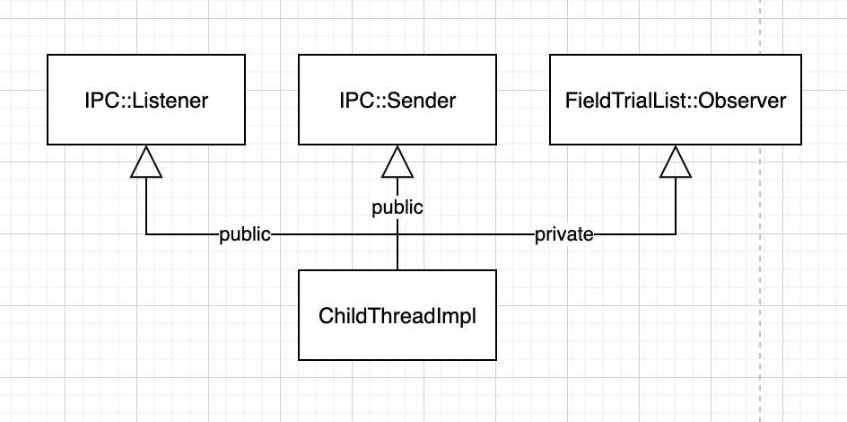
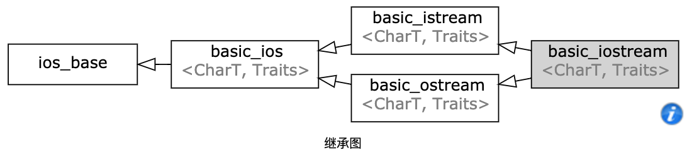

# 多继承与虚继承
这两个一般都是放在一起说的，因为“孟不离焦，焦不离孟”。

# 多继承
先谈多继承。  
大部分文章资料中，都会说少用多继承，使用多继承相当于开启了潘多拉魔盒。因为多继承会将代码变得复杂，耦合程度增加，依赖性变强。可谓是用时一时爽，维护 xxx。  
但存在即合理，这里一般举几个使用多继承的🌰:

## public 继承 + private 继承
之前我们说过 public 继承和 private 继承的语义是不同的，public 继承是 is-a，private 继承是 is-implemented-in-terms of，二者是可以共存的，在《Effective C++》中官方说法是:  
> 多继承可以用在涉及“public 继承某个 Interface class” 和 “private 继承某个协助实现的 class”的两相组合。

我们用 chromuium 中一个 UML 图再举个实际例子:  
  
ChildThreadImpl 类使用了多继承，分别有 public 和 private 继承，但结合语义来看，它的继承关系就很清晰。  
所以多继承也并不是洪水猛兽，重点还是在具体的使用。

*但是一定要在明确和谨慎的情况下使用，如果单一继承行得通，优先使用单继承。*

## 多重 is-a
其实上一节的例子也可以看出，同时存在了两个 public 继承，都满足了 is-a 的关系，都会有多态的场景。  
那还担心啥，大胆的用吧，如果这个不能给你以信心，那么看下图:  
  

不过还是老生常谈，一定要明确语义，明确是真的继承关系。

# 虚继承（virtual）
刚刚说了下多继承，主要是多继承的使用场景。虚继承相较之下就更简单了，总结一下就是:  
- **只有**使用多继承的时候**才可能**使用虚继承

这里有两个关键词加加粗了，分别是「只有」和「才可能」，下面分别说一下。

## 为什么「只有」
虽然从本质上说，public 继承也可以写成 virtual public 继承，但是这会带来额外的性能开销，包括访问速度、包括内存占用。  
而虚继承真正解决的痛点主要在于多继承下的歧义问题，所以，虚继承离不开多继承。  
**任何单继承的场景，都尽量不要使用 virtual base class。**

## 为什么「才可能」
刚刚说到了，虚继承离不开多继承，但是相反的，多继承却可以选择是否使用虚继承。

其实原因也很简单，牢记虚继承是为了解决多继承下的歧义问题，但是歧义问题的出现，必须是某个 base class 在继承体系中出现多次，比如菱形继承。  
那么按如下流程思考，就容易判断你的多继承体系下是否需要使用上虚继承了:  
1. 是否出现了多个相同 base class？
2. 是否一定要解决歧义问题？
3. 是否属性方法不该重复？只能是一份？

回答完这三个问题，也就能判断出是否应该使用上 virtual base class 这把双刃剑了。
