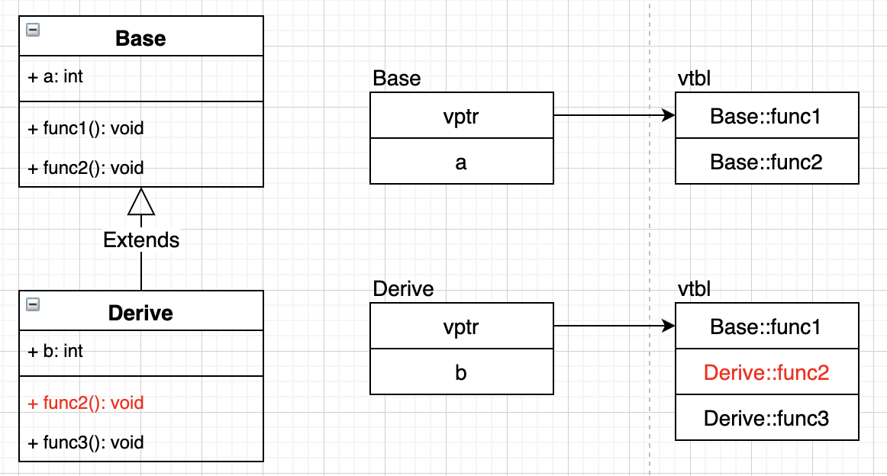
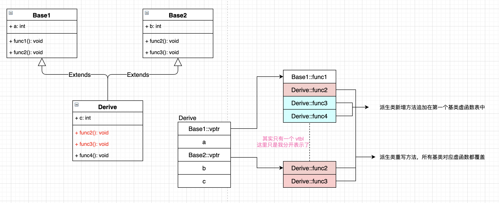

# 聊聊 Virtual Table
对于普通的业务开发来说，知道 virtual 关键字的一些特点就可以了。稍微深入一点，一般就是对象模型了，其实这个网上也有很多资料，我这边就是总结总结。

# 朴实单继承
源码如下:  
```
class Base {
public:
    int a;
    virtual void func1() {
        printf("Base::func1\n");
    }
    virtual void func2() {
        printf("Base::func2\n");
    }
};

class Derive : public Base {
public:
    int b;
    void func2() {
        printf("Derive::func2\n");
    }
    virtual void func3() {
        printf("Derive::func3\n");
    }
    void func4() {
        printf("Derive::func4\n");
    }
};
```
结果图如下:  
  

gcc 跑出来的 class 结构如下(-fdump-class-hierarchy):  
```
Vtable for Base
Base::_ZTV4Base: 4 entries
0     (int (*)(...))0
8     (int (*)(...))(& _ZTI4Base)
16    (int (*)(...))Base::func1
24    (int (*)(...))Base::func2

Class Base
   size=16 align=8
   base size=12 base align=8
Base (0x0x7f967eb52de0) 0
    vptr=((& Base::_ZTV4Base) + 16)

Vtable for Derive
Derive::_ZTV6Derive: 5 entries
0     (int (*)(...))0
8     (int (*)(...))(& _ZTI6Derive)
16    (int (*)(...))Base::func1
24    (int (*)(...))Derive::func2
32    (int (*)(...))Derive::func3

Class Derive
   size=16 align=8
   base size=16 base align=8
Derive (0x0x7f967e9e8208) 0
    vptr=((& Derive::_ZTV6Derive) + 16)
  Base (0x0x7f967eb52f00) 0
      primary-for Derive (0x0x7f967e9e8208)

```
size 的计算简单说下，只需要考虑成员数据 + virtual 方法 相关；Base 和 Derive 下面只有 vptr 和 int，所以 align 取大的为8。

给予一些针对**普通单继承**文字总结:  
1. 基类和派生类都会生成 vtbl，并有 vptr 指向 vtbl。
2. 派生类没有 override 基类虚函数，则用基类的虚函数（func1）。
3. 派生类 override 基类虚函数，则在派生类 vtbl 进行覆盖（func2）。
4. 派生类声明了新的虚函数，则基于派生类 vtbl 进行扩展（func3）。

# 朴实多继承（非虚继承）
源码如下:  
```
class Base1 {
public:
    int a;

    virtual void func1() {
        printf("Base1::func1\n");
    }

    virtual void func2() {
        printf("Base1::func2\n");
    }
};

class Base2 {
public:
    int b;

    virtual void func2() {
        printf("Base2::func2\n");
    }

    virtual void func3() {
        printf("Base2::func2\n");
    }
};

class Derive : public Base1, public Base2 {
public:
    int c;

    void func2() {
        printf("Derive::func2\n");
    }

    void func3() {
        printf("Derive::func3\n");
    }

    virtual void func4() {
        printf("Derive::func4\n");
    }
};

typedef void(*fun)(void);

int main(int argc, char* argv[]) {
    Derive d;

    // +0 Base1::func1
    // +1 Derive::func2
    // +2 Derive::func3
    // +3 Derive::func4
    fun fun1 = *((fun*)*((long long*)(&d)) + 3);
    fun1();

    // +0 Derive::func2
    // +0 Derive::func3
    fun fun2 = *((fun*)*((long long*)(&d) + 2) + 1);
    fun2();
    return 0;
}

```
结果图如下:  
  
对比朴实无华单继承，这里就麻烦一些了，主要是 vptr 和 vtbl 的对应关系。  
**这个例子里面会有两个 vptr，按照继承顺序排列，但是只会有一个 vtbl**，图上我也标明了，这里拆开是因为 vptr 直接指向了 vtbl 不同的地址。

再加上 class 结构可能会清楚些，如下:  
```
Vtable for Base1
Base1::_ZTV5Base1: 4 entries
0     (int (*)(...))0
8     (int (*)(...))(& _ZTI5Base1)
16    (int (*)(...))Base1::func1
24    (int (*)(...))Base1::func2

Class Base1
   size=16 align=8
   base size=12 base align=8
Base1 (0x0x7ff817d2bde0) 0
    vptr=((& Base1::_ZTV5Base1) + 16)

Vtable for Base2
Base2::_ZTV5Base2: 4 entries
0     (int (*)(...))0
8     (int (*)(...))(& _ZTI5Base2)
16    (int (*)(...))Base2::func2
24    (int (*)(...))Base2::func3

Class Base2
   size=16 align=8
   base size=12 base align=8
Base2 (0x0x7ff817d2bf00) 0
    vptr=((& Base2::_ZTV5Base2) + 16)

Vtable for Derive
Derive::_ZTV6Derive: 10 entries
0     (int (*)(...))0
8     (int (*)(...))(& _ZTI6Derive)
16    (int (*)(...))Base1::func1
24    (int (*)(...))Derive::func2
32    (int (*)(...))Derive::func3
40    (int (*)(...))Derive::func4
48    (int (*)(...))-16
56    (int (*)(...))(& _ZTI6Derive)
64    (int (*)(...))Derive::_ZThn16_N6Derive5func2Ev
72    (int (*)(...))Derive::_ZThn16_N6Derive5func3Ev

Class Derive
   size=32 align=8
   base size=32 base align=8
Derive (0x0x7ff817bd28c0) 0
    vptr=((& Derive::_ZTV6Derive) + 16)
  Base1 (0x0x7ff817d94060) 0
      primary-for Derive (0x0x7ff817bd28c0)
  Base2 (0x0x7ff817d940c0) 16
      vptr=((& Derive::_ZTV6Derive) + 64)

```
注意 Class Derive 下的 +16 和 +64，这就是 vptr 指向的地址，分别是 Base1::func1 和 Derive::func2，可以对照图来看。

给予一些针对**普通多继承**文字总结:  
1. 有几个基类就会有几个 vptr，按继承顺序排列。
2. 真实只有一个 vtbl，**但可以虚拟看作多个**。
3. 派生类 override 的基类虚函数，vtbl 中都要重写。
4. 派生类声明了新的虚函数，则在第一个基类 vptr 指向的 vtbl 后面插入。