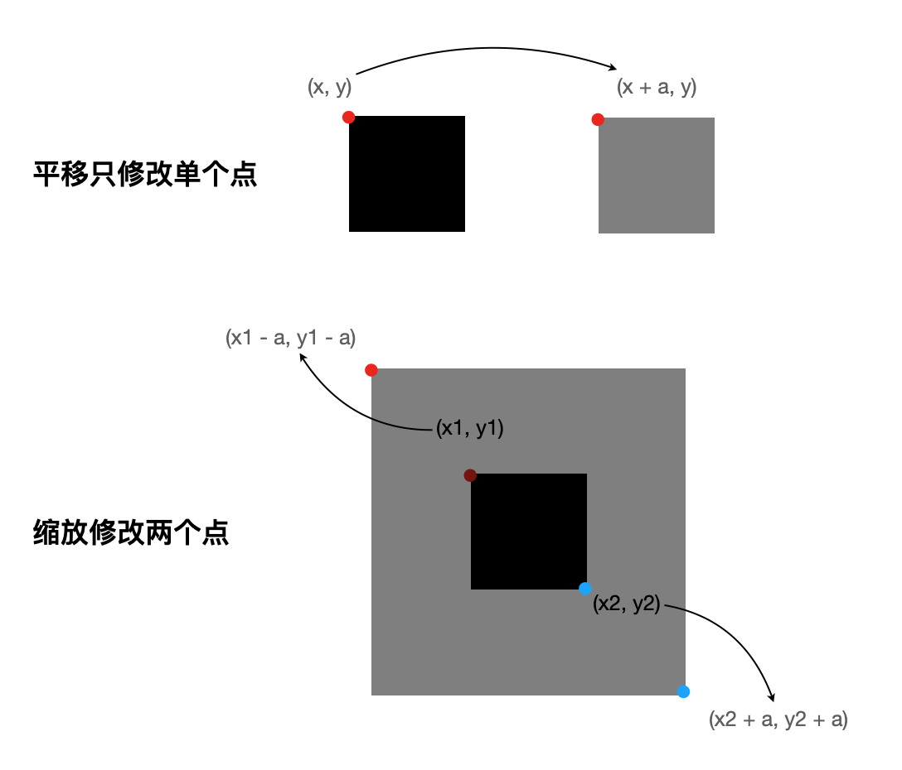
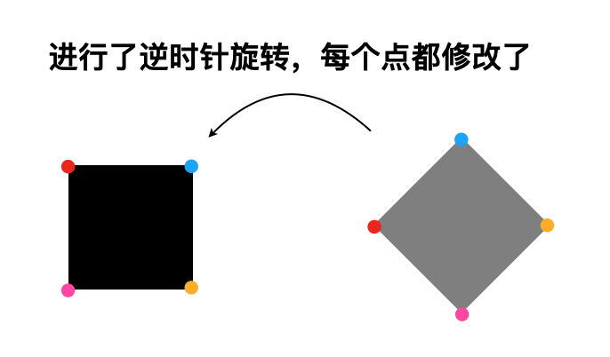
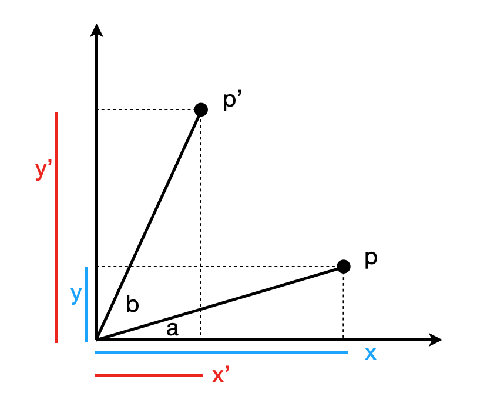
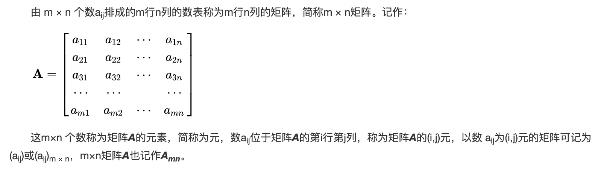
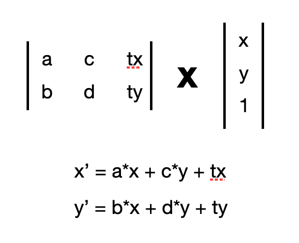
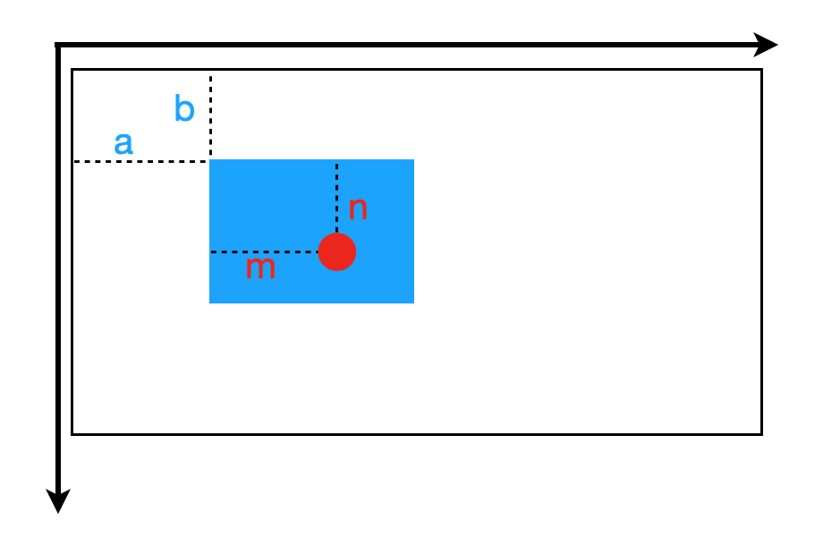

# 水一篇关于 matrix 的入门介绍

# 先从动画说起
对于接触过 Canvas 的程序员来说，我们知道绘制一个物体一定需要坐标，也就是物体在画布上的位置。当这个位置不停的在变化时，就产生了动画的效果，如下面所示:  
[矩形移动动画](./demo/1.html)  

上面的例子，我们修改的是 x，y，就有了平移动画，我们也可以在修改 x，y 的同时修改 width，height，就会有缩放动画:  
[矩形缩放动画](./demo/2.html)  

这里我们发现，对于单纯的移动，缩放的代码已经变得稍微复杂一些了，本质上是因为我们操作的点，由一个变成了两个，可以看下图:  
  
**注意！这里「非操作点」，并不是说没有坐标上的变化，而是它们（比如矩形右上角的点），都是可以通过「操作点」快速得到数据**

这时候，那如果我们想实现一个旋转的动画改怎么办？结合上图，我们很容易想到旋转矩形，本质上是修改了它四个点的坐标:  
  
感觉很麻烦，赶紧看看官方教程，canvas 如何旋转一个物体，链接在此[https://developer.mozilla.org/en-US/docs/Web/API/CanvasRenderingContext2D/rotate](https://developer.mozilla.org/en-US/docs/Web/API/CanvasRenderingContext2D/rotate)，代码如下:  
```
const canvas = document.getElementById('canvas');
const ctx = canvas.getContext('2d');

// Point of transform origin
ctx.arc(0, 0, 5, 0, 2 * Math.PI);
ctx.fillStyle = 'blue';
ctx.fill();

// Non-rotated rectangle
ctx.fillStyle = 'gray';
ctx.fillRect(100, 0, 80, 20);

// Rotated rectangle
ctx.rotate(45 * Math.PI / 180);
ctx.fillStyle = 'red';
ctx.fillRect(100, 0, 80, 20);

// Reset transformation matrix to the identity matrix
ctx.setTransform(1, 0, 0, 1, 0, 0);
```
可以看到，这里的核心是通过调用了 context 的一个接口 ———— rotate 实现的旋转，前后传入的类坐标信息都是 (100, 0, 80, 20)，为什么可以做到？这里的原理看完后面的内容自然就知道了，我们先不说，而是头铁尝试一下自己修改四个点的坐标来实现旋转。  

那么我们来推导一下点的旋转变化，看下图:  
  

P 是旋转前的点，坐标表示为 (x, y)，其中我们把 x，y 用角度表示出来就是:  
x = r * cos(a)  
y = r * sin(a)  
*注意：r 是边长*

P' 是旋转后的点(*b是旋转角*)，坐标表示为 (x', y')，其中我们把 x', y' 用角度表示出来就是:  
x' = r * cos(a + b)
y' = r * sin(a + b)  

用两角和公式展开 x'，y'  
x' = r * cos(a) * cos(b) - r * sin(a) * sin(b)  
y' = r * sin(a) * cos(b) + r * sin(b) * cos(a)  

在代入 x，y 的公式，可得:  
x' = x * cos(b) - y * sin(b)  
y' = y * cos(b) + x * sin(b)

那还等啥，我们快用这个公式试试  
[矩形旋转动画](./demo/3.html)   
可以看到，矩形已经旋转起来啦，并且我们不是通过调用 api，而是自己操作顶点做到的。  

# 矩阵的表达
上一节我们知道了如何实现简单的三种动画效果，虽然操作顶点很辛苦，但是熟练起来好像也不过如此？  
那是因为单一动画的复杂度确实不高，但是当动画组合起来，如果还是像上一节一样去计算顶点，那复杂度将会成倍的提高。不信的同学可以写一个这样的动画: 一个矩形，围绕某个点做圆周运动，并且这个矩形同时还有这缩放效果。

这个问题的核心，是我们能否找到一个**转换公式**，可以**清晰**且**不冲突**的修改点的坐标，以此来实现基本变化。这个公式就是我们的矩阵啦。  
这里直接使用百度百科的一个矩阵介绍:  
  

在程序中，矩阵一般用二维数组来表示，清晰明了，不明白的冲这个[https://leetcode-cn.com/problems/spiral-matrix/](https://leetcode-cn.com/problems/spiral-matrix/)  

虽然矩阵的结构是 m * n，但是不要害怕多，因为我们讨论的都是二维平面，我们的点是通过 [x, y] 来描述的，那么矩阵理论上是 2 * 2，**不过这里我们为了让矩阵支持平移**，所以引入了其次坐标，所以二维矩阵一般都是  
```
[
    [a, c, tx]
    [b, d, ty]
]
```
这样表示，所以矩阵和点相乘是如下图这样的:  
  

我们观察一下变化后的点公式:  
x' = a * x + c * y + tx;  
y' = b * x + d * y + ty;  
接下来先根据该公式，我们来介绍一些常见的矩阵。

# 常见矩阵及其操作
## 平移矩阵
平移是最简单滴，由之前的公式可以很容易的看出，我们只需要使用 tx，ty 就可以做到平移的效果，所以平移矩阵如下:  
| 1 | 0 | tx |  
| 0 | 1 | ty |  
坐标应用平移矩阵的结果就是:  
x' = x + tx;
y' = y + ty;

## 缩放矩阵
缩放矩阵也比较简单，我们直接给结果:  
| sx | 0  | 0 |  
| 0  | xy | 0 |  
坐标应用缩放矩阵的结果就是:  
x' = x * sx;  
y' = y * sy;  

## 旋转矩阵
旋转矩阵我们之前推导过了，这里我们也直接给结果:  
| cos | -sin | 0 |  
| sin | cos  | 0 |  
坐标应用缩放矩阵的结果就是:  
x' = x * cos - y * sin;  
y' = x * sin + y * cos;

## 连续矩阵变换
虽然我们得到了三个矩阵，那遇到复合动画就可以很好的解决了吗？当然可以，因为得到结果的过程相当于是:  
P' = M(M(M(P)))  
其中 P 是点，M 是需要变化的矩阵，那我们来实现一下第二节说的那个动画效果。  
[矩形复合动画](./demo/4.html)  
*注：这个例子主要是让大家认识到 P' = M(M(M(P))) 这个过程，标准做法中，矩阵一般是不变的，并且可以提前合并的。*

矩阵的合并就是把数学公式转为代码，这里就不展开了，需要注意的就是一般矩阵没有交换律，所以两个矩阵a、b，a x b 和 b x a 的结果是不同的，顺序一定要注意。

## 逆矩阵
最后提一下逆矩阵，逆矩阵在图形图像交互中比较重要，我们知道当 shape 出现嵌套，一般都是相对坐标来描述的，比如下图:  
  
这里红色点的相对坐标是 (m, n)，全局坐标是 (x, y)，可得:  
x = a + m;  
y = b + n;  
可以看到，从相对坐标到全局坐标很方便，这不就是一个平移矩阵变换么  
P(全局坐标) = M * P(相对坐标)  

那怎么样从全局坐标求得相对坐标呢？矩阵是无法表示除法的，但我们可以用逆矩阵相乘来表示除法，所以可得:  
P(相对坐标) = P(全局坐标) / M = N * P(全局坐标)  
其中 N 是 M 的逆矩阵。
