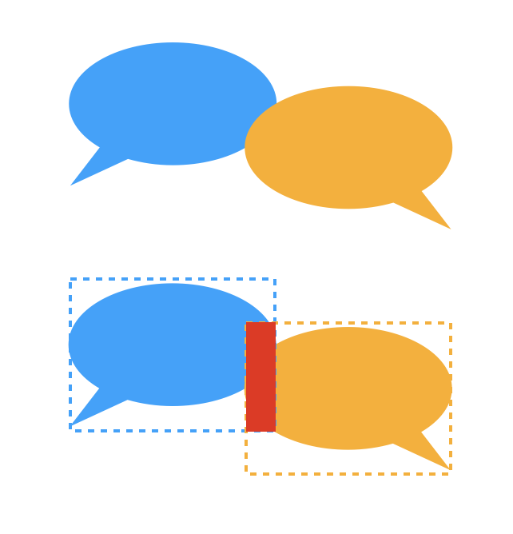
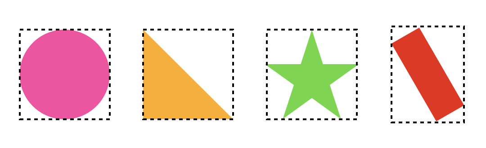
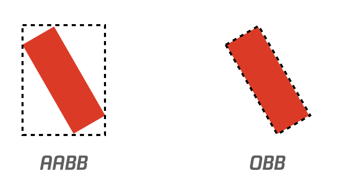
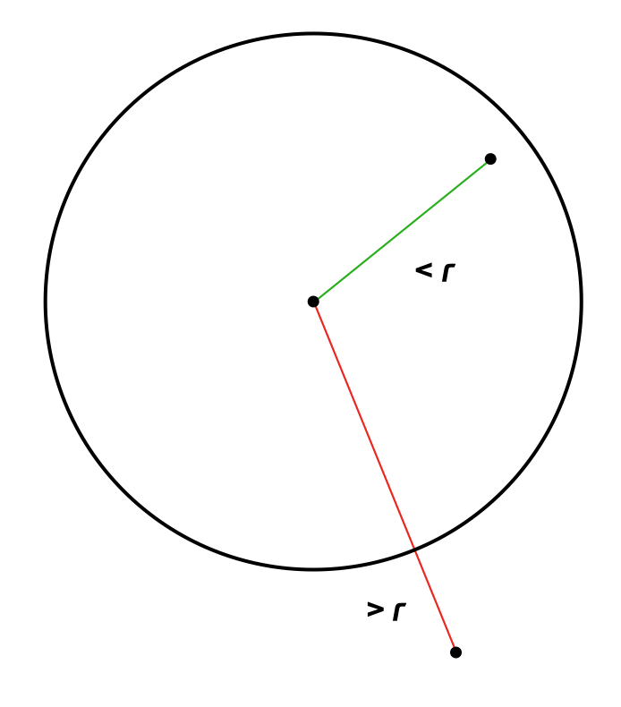
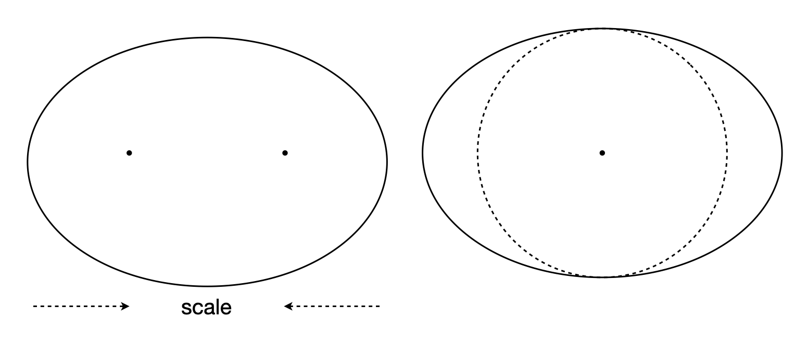
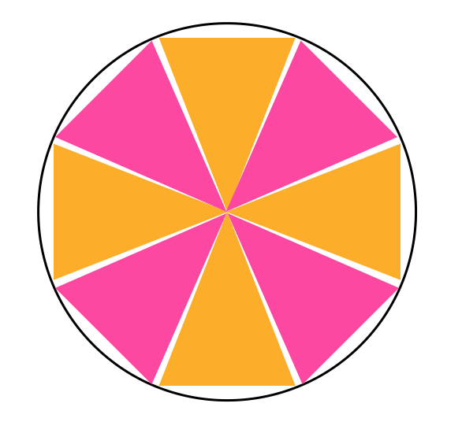
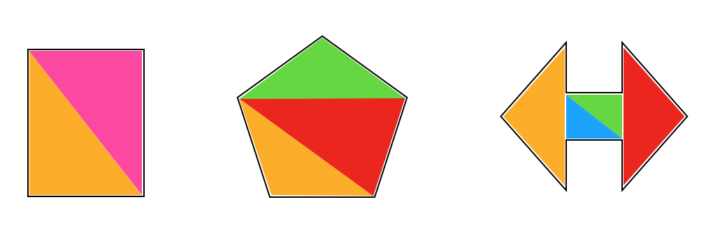
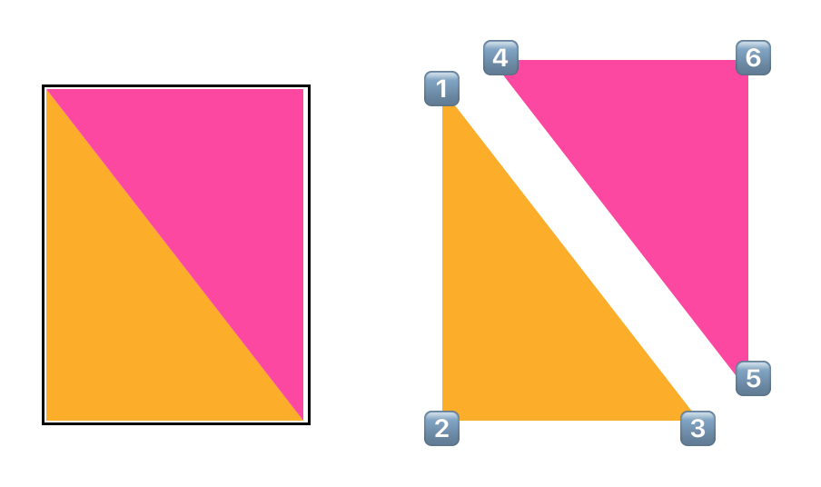
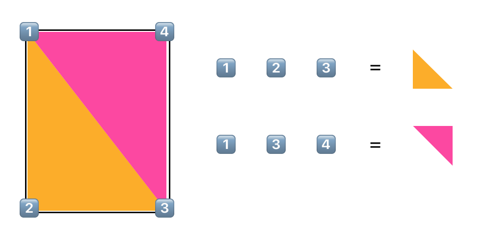
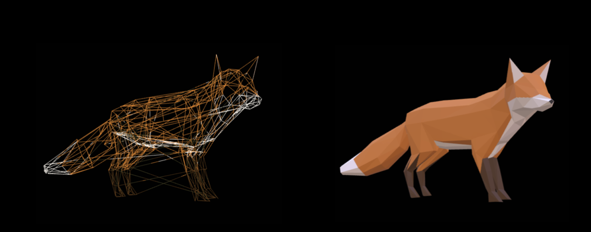

# Shape 入门介绍
形状大家应该都不陌生，生活中处处可见，本文随便聊聊关于各类形状二三事。

# 矩形
矩形应该是我们接触最多的图形，特别是作为前端开发时，最早一定接触过 div，div 设置了宽高之后，就是一个矩形。所以我们一般用如下的方式表示一个矩形:  
```
class Rectangle {
    // 矩形起点
    public x: number;
    public y: number;
    // 矩形宽度、高度
    public width: number;
    public height: number;
};
```
矩形应该是我们接触最多的图形了，屏幕上各种窗口、图标、图片等等，都是矩形（这里不展开谈论圆角矩形）。

因为矩形方便简单好理解，**我们经常将一些复杂的图形，在某些计算的时候，用矩形包裹起来**，这里的计算可以是包含检测、碰撞检测之类的。如下图:  
  
两个聊天气泡的的碰撞，我们如果想判断是否发生交集，硬检测很麻烦，但如果像下面那样用矩形包裹起来，就很方便了。  

上面这种方式，也就是经典的 AABB 模型(Axis-aligned bounding box)，任何元素都可以拥有自己的 AABB，如下图:  
  

可以看到，AABB 模型在某些情况下利用率很捉急，**特别是一个矩形发生了旋转**，那对于这种情况有没有什么办法优化么？当然是有的，我们可以在 x, y, width, height 这四个基础参数上再增加一个旋转的参数 rotation，将 AABB 模型变成 OBB 模型(Oriented bounding box)，如下图:  
  

OBB 对比 AABB 提高了利用率，但是降低了检测计算的性能，下面是一个点击判断的 demo:
[./demo/1.html](./demo/1.html)  
可以点击 Canvas 区域来看，判断点到了 aabb 范围，还是 obb 范围。

*包裹盒不止这两种，这里就不展开了，对此感兴趣的同学可以查阅 bounds 相关资料。*

# 圆形
矩形说完咱们就来说一说圆，毕竟当棱角磨平了，矩形就变成了圆……  

## 正圆
我们平时说的圆，基本上都默认为正圆，一个正圆的表示非常简单:  
```
class Circle {
    // 圆心坐标
    public x: number;
    public y: number;
    // 半径
    public radius: number;
}
```
圆同样是一个很基础的图形，有着一个非常重要的属性 —— radius，利用半径可以很方便的判断点和圆的关系:  
  
之前在 Vector 介绍中也提过利用半径和点积来判断圆和线的关系，这些都表明了，半径在圆的一些计算中便利性。

## 椭圆
上一小节重点指出了半径对于圆的重要性，那么问题来了，椭圆也是圆，但是人家的半径变成了长轴短轴。我们先看一下一般椭圆的表示方式:  
```
class Ellipse {
    // 中心坐标
    public x: number;
    public y: number;
    // 宽度
    public width: number;
    // 高度
    public height: number;
}
```
既然半径是最方便的，我们就得想办法将椭圆的长短轴变成半径，仔细观察椭圆可以发现，可以通过 scale 缩放，将长短轴相等，此时椭圆就变成了正圆。  
所以我们在椭圆计算时，通常都会找到一个 scale matrix，并使用该 matrix 处理，下面是把椭圆 scale 成圆的原理。  
  

最后这里再提一下圆的绘制渲染，一般我们如果用 div，可以使用 border-radius: 50% 来绘制一个圆，Canvas 中更是提供了便捷的 arc api 来绘制圆，那我们有办法使用 Circle 的属性来自己绘制一个圆么？当然是可以的，借助于三角函数

# 三角形
讲三角形之前，我们回顾一下圆的渲染绘制，一般我们如果用 div，可以使用 border-radius: 50% 来绘制一个圆，Canvas 中更是提供了便捷的 arc api 来绘制圆。  
那我们有办法用更基础的能力来绘制一个圆么？可以的，我们可以使用三角形 + 三角函数。  
  

具体实现如下:  
[./demo/2.html](./demo/2.html)  

三角形也可以称为图形之源，因为任何图形都可以由三角形来组成，前面说的是圆，那些矩形多边形就更加的方便了:  
  

一般三角形的程序表达可以是这样:  
```
class Triangle {
    // 三个顶点坐标，length 必须等于 3
    public points: {x: number, y: number}[];
}
```

当我们用两个三角形来描述出一个矩形时:  
  
可以看到，两个三角形是有顶点重叠的，并且图形越复杂，顶点重叠的可能也就越多，所以这里有一种索引优化顶点数量的方案，原理如下:  
  
此时真实的顶点只有四个，然后通过额外的一种索引来选择这些顶点，组合成不同的三角形。  

熟悉 webgl 的同学一定很清楚，这就是 xxx 这两个 api 调用的区别。

  
🦊的图

# 总结
以上就是一些基础图形的介绍，熟悉了基础图形的一些特点，我们也能应用到高级图形中去。
