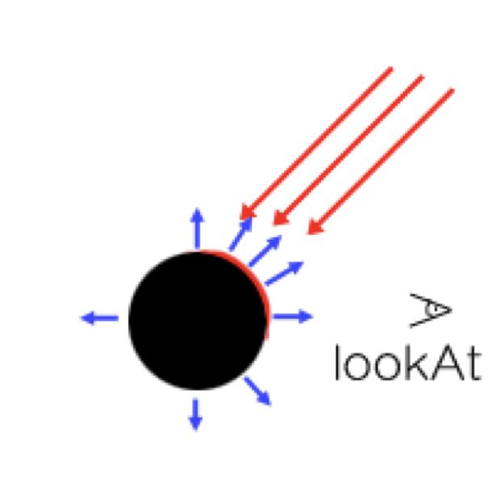

# 水一篇关于 vector 的入门介绍

# 什么是向量
上来先贴一张维基百科的图:  
  
文字很多，还扯到了电流啥的……我来精简一下，向量就是**有大小**，**有方向**，**满足平行四边形法则**的几何对象。这里有三个重点词，我们稍微讲一下:  

  
上图中 AB 就是一个向量，其中 A 点的坐标是 (1, 1)，B 点坐标是 (2, 2)  
1. 有大小  
大小也就是向量的长度，这里的长度我们可以轻而易举的用勾股定理计算出来，就不列公式了，不会算的同学心里向数学老师道个歉。  
**注意：我们一般用 |AB| 来表示向量的大小。**  
2. 有方向  
图中因为箭头的存在也很明显，方向就是从 A 到 B，所以这里我们是用 AB 来表示。如果改成 BA，那就意味着向量的方向是从 B 到 A。  
3. 满足平行四边形法则  
  
用一张图来表明什么是平行四边形法则，上图中每种颜色是一个向量，分别有 AB、AC、AP，其中 AP = AB + AC。我们可以用 AB、AC 作为邻边，绘制出来平行四边形（看图中虚线），此时平行四边形的对角线，便是二者的和，这就是平行四边形法则，向量也满足该法则。

数学中我们知道用两个点来表示向量，程序中也很方便，如下
```
class Vector {
public:
    int vx;
    int vy;
}
```
*注意：向量需要有大小和方向，并没有规定死起点与终点，所以并不需要有两个 Point 去实现 Vector。*

# 向量的作用
知道了向量是什么和如何表示，接下来看一点实在的内容 ———— 向量的作用。实际中，我们主要是用向量的点积和叉积来解决一些问题。

## 点积
点积又称内积、数量积（*注意理解数量*）  
它的数学定义如下:  
  
向量的大小相乘，再乘以两个向量夹角的 cos，我们画个图分析一下:  
  
这里有三个向量，分别是 AB、AC、AD  
其中 AB 与 AC 求点积，夹角为 a，结合三角函数 cos 的效果，相当于是 AC 在 AB 上的投影长度，与 AB 的长度相乘。  
同理，AB 与 AD 求点积，夹角为 b，相当于是 AD 在 AB 上的投影长度，与 AB 的长度相乘。  

两个长度相乘有什么用我们暂时先不考虑，我们先观察一下夹角 cos 的特点，可以得到**当两个向量的夹角小于90度时，它们的点积一定是正数，因为 cos > 0，两个长度也肯定大于0。**  
也就是说**点积越大，两个向量的方向越一致（夹角小了）；点积越小，两个向量的方向越相反（极限就是180度两个向量背道而驰）。**  
所以当我们需要判断两个有向线段方向时，可以使用点积，比如光照效果。

  
这里用球举例，当环境中一处光源向球打光，球哪些地方需要高亮呢？这时候我们就可以计算光源方向的向量和球上点的法向量的点积来判断，效果如下:  
[当有向光源照射到球体](./demo/1.html)  
涉及到一些 webgl 的代码比较复杂，其中处理光照的核心代码如下:  
```
// 增加一些完善的注释

// 归一化光向量
vec3 L = normalize(uLightDirection);

// 归一化球上点的法向量
vec3 N = normalize(vNormal);

// 注意：这里光向量取了反，这样计算点积的时候，越接近1（两个向量都归一化了，长度为1，只看 cos 夹角），意味着应该越亮
float lambertTerm = dot(N, -L);

// Ia 是环境光带来的颜色，影响因素是环境光的大小和物体材质在环境光下的情况
vec4 Ia = uLightAmbient * uMaterialAmbient;

// Id 是有向光漫射带来的效果，影响因素是有向光的大小和物体材质在有向光下的漫射情况（注意，这里是漫射）
// 默认是黑色的
vec4 Id = vec4(0.0, 0.0, 0.0, 1.0);

// 当前面计算出的 lambertTerm 大于 0 时，意味着被有向光照射到了，出现漫射的情况
if (lambertTerm > 0.0) {
    // 计算漫射
    Id = uLightDiffuse * uMaterialDiffuse * lambertTerm;
}

// 最终颜色
vec4 finalColor = Ia + Id;
```
有点晕的话就结合前面的图来看即可。  

这里展开一下，上一个例子只说到了漫射，其实在现实中不太真实，因为物体材质反射率高的时候，会出现镜面反射，出现光斑，也就是下面的效果。  
[有向光下增加了镜面反射的球体](./demo/2.html)  
这里镜面反射的实现，其实也用到了点积！大家感兴趣可以自己看源码，这里就不详细说了。

点积还有一些其他的应用，比如我们能很轻松的判断一个点在不在圆内，借助点积，我们也能轻松的判断一条线与圆的关系:  
  
代码就不给了，能看图理解即可~

例子中我们都是直接调用 dot 这样系统提供的点积函数，其实点积的计算非常方便:  
A·B = A.vx * B.vx + A.vy * B.vy;

在回忆本节的开头，现在能深刻理解到点积为什么又称为数量级了么？

## 叉积
点积又称外积、向量积（*注意理解向量*）  
它的数学定义如下:  
  
叉积又称**向量积**，意味着结果是有方向的，从数学定义上可知，叉积的计算结果是一个向量，这个向量垂直于 a、b 两个向量所成的平面。  
而我们知道垂直于平面的向量有两个，互为相反向量，**这里结果具体是哪个，就是方向的表现。**

具体可以看下图:  
  
快速判断叉积的方法就是右手法则，很简单，如果忘了就网上搜一下。  

这里我们先说一下程序中，叉积的计算方式，先给出计算方程:  
A×B = A.vx * B.vy - B.vx * A.vy;  
大家可能会疑惑，不是说结果是一个向量么？有大小有方向才对，而上面这段代码，执行完看起来像个标量？  
因为这里是依靠 sin 计算出的正负，**表示的是方向**。不同于点积，**点积的正负，表示的是计算结果是正值还是负值**。

那接下来看一下叉积的应用，一个结合 sin 的区间性，我们可以判断一个点在一个向量的左边还是右边，再发散一下，也就是说我们可以判断两个线段（看作向量）是否相交。  
  
如上图所示，有两个线段 AB、CD，我们把看作向量，当两个向量相交时，C点和D点会在向量 AB 的左右两侧。借此原理，我们可以实现线段是否相交的检测。  
[线段检测是否相交](./demo/3.html)  
可以在画布上画线，判断是否相交，我们看一下核心代码:  
```
isCrossLine(line) {
    const a = this.p0;
    const b = this.p1;
    const c = line.p0;
    const d = line.p1;

    // 针对向量 ca 和 cb 求叉积
    const ca_cb = (a.x - c.x) * (b.y - c.y) - (a.y - c.y) * (b.x - c.x);
    // 针对向量 da 和 db 求叉积
    const da_db = (a.x - d.x) * (b.y - d.y) - (a.y - d.y) * (b.x - d.x);
    // 如果结果大于零，意味着c点和d点，一定在 ab 的一侧
    if (ca_cb * da_db > 0) {
        return false;
    }

    // 针对向量 ac 和 ad 求叉积
    const ac_ad = (c.x - a.x) * (d.y - a.y) - (c.y - a.y) * (d.x - a.x);
    // 针对向量 bc 和 bd 求叉积，注意，这里可以用优化的写法，因为平行四边形法则
    const bc_bd = ac_ad + ca_cb - da_db;
    if (ac_ad * bc_bd > 0) {
        return false;
    }

    return true;
}
```

只需要注意一下，这里不能只求一边，因为可能出现这样的情况:  
  
不能因为 C 和 D 不在 AB 的一侧就认为相交，而是需要以 CD 为边再检测一遍。

