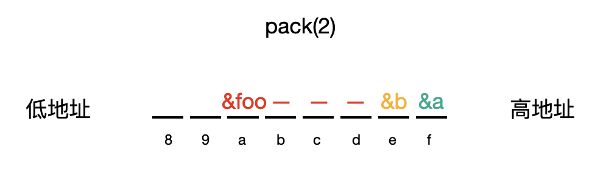

# 内存对齐
总结一下内存对齐的一些点，虽然现在大家已经不怎么关注这个了，但还是可以了解一下。  
为什么需要内存对齐主要和不同设备之间移植、提高内存访问效率有关，具体就不展开了。

## 代码感受内存对齐
我们从代码出发，一般内存对齐会和类的大小息息相关。看如下的例子:  
```
class Foo {
public:
    int a;
};

class Bar1 {
public:
    int a;
    long long b;
    int c;
    long long d;
};

class Bar2 {
public:
    long long a;
    int b;
    int c;
    long long d;
};

int main(int argc, char* argv[]) {
    printf("Foo size: %d\n", sizeof(Foo));
    printf("Bar1 size: %d\n", sizeof(Bar1));
    printf("Bar2 size: %d\n", sizeof(Bar2));
    return 0;
}

// 结果
Foo size: 4
Bar1 size: 32
Bar2 size: 24
```
先从简单的看起，Foo 相信大家一眼就能知道大小，因为只有一个内部成员变量（非 static），所以占据大小是4个字节。  
但是 Bar1 和 Bar2 就很奇怪了，都有四个成员变量，分别有两个 int，两个 long long，按道理大小应该是 (4+8) * 2 = 24 才对，那为什么 Bar1 占据空间大小是 32 呢，这就是因为内存对齐的存在。

咱们先把内存对齐的规则列一列，也不多，最后画出 Bar1 和 Bar2 的内存结构图。  
了解对齐规则之前，我们先给一些概念。

## 基本概念
1. 对齐基数。  
这个在 gcc 中一般默认是4或者8（32位和64位系统），可以通过 #pragma pack(n) n = 1,2,4,8,16 来改变这个基数。
2. class 中最长的数据类型长度。  
也就是 class 中变量，sizeof 最长的类型。  
```
class Test1 {
    char a;
    int b;
};
// Test1 最长数据类型长度为4.

class Test2 {
    int b;
    long long c;
};
// Test2 最长数据类型长度为8.
```
3. 有效对齐值，对齐基数和 class 中最长的数据类型长度中的较小值（上面1，2中的较小值）。

了解了上面三个概念，我们就来看一下内存对齐的规则。

## 内存对齐规则
1. 结构体的首地址能被有效对齐值整除。  
```
class Foo {
public:
    int a;
};

int main(int argc, char* argv[]) {
    char a;
    char b;
    Foo foo;
    printf("a adress: %p\n", &a);
    printf("b adress: %p\n", &b);
    printf("Foo adress: %p\n", &foo);
    return 0;
}

// 输出结果:
a adress: 0x7ffee6dee93f
b adress: 0x7ffee6dee93e
Foo adress: 0x7ffee6dee938
```
这里大概内存布局是这样的:  
  
因为要保证 foo 的首地址可以被**有效对齐值(4)**整除，所以起始位置没有
以上是在 pack = 4 的时候，如果改成 pack = 2，那么就会变成下面这样:  
  

2. 结构体中**每个成员**对于**结构体首地址**的**偏移**（offset）都是**该成员大小与有效对齐值中较小值**的整数倍。  
第二点看起来稍微复杂些，文字比较多，但本质上也很简单，我们用开场的例子来说就明白了。
```
#pragma pack(8)
// 对齐基数是 8
// Bar1 和 Bar2 的最长数据类型是 long long
// 所以有效对齐值是 8

class Bar1 {
public:
    int a; // 从0开始，此时 size=4
    long long b; // 本身占用8，当前偏移4，需要补4，所以 size=4+4+8
    int c; // 本身占用4，当前偏移16，所以 size=16+4
    long long d; // 本身占用8，当前偏移20，需要补4，所以 size=20+4+8
};
// 由此可知 Bar1 的总 size=32 是怎么来的啦。

class Bar2 {
    long long a; // 从0开始，此时 size=8
    int b; // 本身占用4，当前偏移8，所以 size=8+4
    int c; // 本身占用4，当前偏移12，所以 size=12+4
    long long d; // 本身占用8，当前偏移16，无需补，所以 size=16+8
};
// 由此可知 Bar2 的总 size=24 是怎么来的啦。
```
如果将上面的代码改成 pack(4)，那么 Bar1 和 Bar2 所占用的大小就一致了。

3. 结构体的**总大小**是**有效对齐值**的整数倍，不够的话就在结构体最后一个成员后填充。  
这个很简单，直接看个代码即可。
```
class Foo {
public:
    int a;
    char c;
};

printf("foo size: %d\n", sizeof(Foo));
// 结果 foo size: 8
```

## 总结
以上就是关于内存对齐的一些规则。