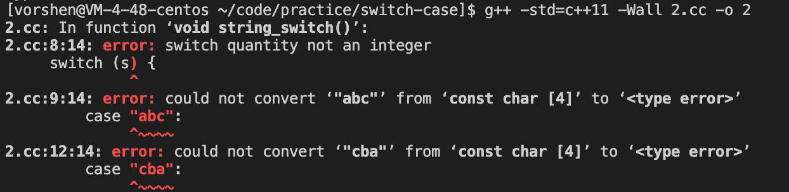
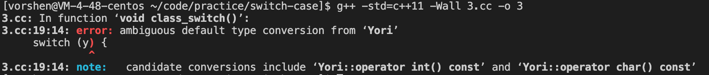

# switch-case in c++
javascript 中 switch case 里可以 case 任意类型的元素，如下代码
```
let a = {};

switch(a) {
    case 1:
        console.log('number');
        break;
    case '2':
        console.log('string');
        break;
    case {}:
        console.log('object');
        break;
    default:
        console.log('default');
}
```
然而在 C++ 中就不可以了，C++ 中 switch 和 case 后面的结构有如下规则:  
- switch 语句中的 expression 必须是一个整型或枚举类型，或者是一个 class 类型，其中 class 有一个单一的转换函数将其转换为整型或枚举类型。
- case 的 constant-expression 必须与 switch 中的变量具有相同的数据类型，且必须是一个常量或字面量。

先看 switch 的正常场景
```
#include <stdio.h>

void number_switch() {
    int i = 0;
    switch (i) {
        case 0:
            printf("0\n");
            break;
        case 1:
            printf("1\n");
            break;
        default:
            printf("default\n");
    }
}

void bool_switch() {
    bool i = true;
    switch (i) {
        case true:
            printf("true\n");
            break;
        case false:
            printf("false\n");
            break;
        default:
            printf("default\n");
    }
}

void char_switch() {
    char c = 'c';
    switch (c) {
        case 'c':
            printf("c\n");
            break;
        case 'd':
            printf("d\n");
            break;
        default:
            printf("default\n");
    }
}

void enum_switch() {
    enum Type {
        A,
        B
    };
    Type b = Type::B;

    switch (b) {
        case Type::A:
            printf("type::A\n");
            break;
        case Type::B:
            printf("type::B\n");
            break;
        default:
            printf("default\n");
    }
}

int main(int argc, char* argv[]) {
    number_switch();
    bool_switch();
    char_switch();
    enum_switch();

    return 0;
}
```
这里分别有四种类型的 switch，如果编译的话，bool_switch 会得到一种 warning
```
main.cc:19:12: warning: switch condition has boolean value [-Wswitch-bool]
```
不过因为 bool 可以隐式转换为 0、1，所以只是 warning 就是了，还可以正常使用  

下面的代码直接会编译报错了
```
void string_switch() {
    string s = "abc";
    switch (s) {
        case "abc":
            printf("abc\n");
            break;
        case "cba":
            printf("cba\n");
            break;
        default:
            printf("default\n");
    }
}
```
  

此时我们需要考虑如何将字符串变成整型，hash 函数就是很好的解决方案  
下面是解决方案  
```
#include <stdio.h>
#include <string>

using std::string;

typedef std::uint64_t hash_t;  
   
constexpr hash_t prime = 0x100000001B3ull;  
constexpr hash_t basis = 0xCBF29CE484222325ull;  
  
hash_t hash_(char const* str) {
    hash_t ret{basis};
   
    while (*str) {
        ret ^= *str;
        ret *= prime;
        str++;
    }
   
    return ret;
}

// 普通写法
constexpr hash_t hash_compile_time(char const* str, hash_t last_value = basis) {
    return *str ? hash_compile_time(str + 1, (*str ^ last_value) * prime) : last_value;
}

// 优化完善
constexpr hash_t operator "" _hash(char const* p, size_t) {
    return hash_compile_time(p);  
}  

void string_switch() {
    string s = "abc";
    switch (hash_(s.c_str())) {
        case hash_compile_time("abc"): // 使用普通写法
            printf("abc\n");
            break;
        case "cba"_hash: // 使用完善优化
            printf("cba\n");
            break;
        default:
            printf("default\n");
    }
}

int main(int argc, char* argv[]) {
    string_switch();
    return 0;
}
```

关于 class，那 class 类型可以做到 switch case 么？我们来试下  
```
#include <stdio.h>

class Yori {
public:
    Yori(char v): v_(v) {}
    operator char() const {
        return v_;
    }
private:
    char v_;
};

void class_switch() {
    Yori y('c');

    switch (y) {
        case 'c':
            printf("c\n");
            break;
        case 'd':
            printf("d\n");
            break;
        default:
            printf("default\n");
    }
}

int main(int argc, char* argv[]) {
    class_switch();
    return 0;
}
```
可以成功执行，这是因为我们给 class 定义了一个**单一**的类型转换函数，如果有多个类型转换函数，则不可以了，比如我们添加了 int 类型的转换
```
class Yori {
public:
    Yori(char v): v_(v) {}
    operator char() const {
        return v_;
    }
    operator int() const {
        return v_;
    }
private:
    char v_;
};
```
就会收获如下的报错  
  
