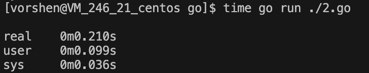
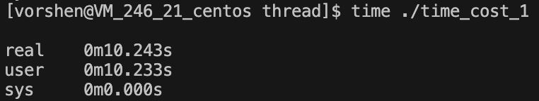

# 导语
最近团队进行了一些线程的讨论，这里抽空水了一篇关于线程的文章，希望给没接触过线程相关知识的同学入个门。

# 线程是什么
### 进程
既然要说线程，那就不得不提它的两个好兄弟，进程、协程。
进程大家应该是最了解的，平时用的 ps 命令就是查看计算机中的进程情况，进程的特点：

1、独立，资源（内存）隔离，互不干扰

2、拥有自己的生命周期和状态

让人又爱又恨的 chrome，每个 tab 在默认情况下是单独的进程，流畅是真的，内存大户也是真的。

### 线程
结合进程的特点，可以显而易见发现进程的劣势在于资源的同步，因为互相隔离，无法共享内存，那样一些数据共享的场景，就需要借助比如管道、Signal、Socket 等手段来完成，增加了成本。

线程就可以解决上述场景，线程是进程的组成部分，它拥有的资源都是来自于进程，也就意味着同一个进程下的不同线程，资源是共享的。


### 协程
线程虽然解决了资源的问题，但是它和进程在底层上都是交给操作系统去管理，cpu 不仅仅要关注进程上下文的切换，也需要考虑线程之间的切换，每一次切换都是性能的开销。

一个优秀的程序员可以不脱发，但是不能不追求性能，所以协程应运而生。协程的特点就是它是应用层面的，不再交由操作系统去切换处理，由开发者自己控制，减少上下文切换开销。

go 中的 goroutine 就算是一种特殊的协程，大概代码如下
```
// ...package import
func fibonacci(i int64, endChan chan<- bool) {
    result := calc(i)

    fmt.Printf("Result: %d \n", result)

    endChan <- true
}

func calc(i int64) int64 {
    if i < 3 {
        return 1
    }

    return (calc(i-1) + calc(i-2))
}

func main() {
    endChan := make(chan bool)

    for i := 0; i < 5; i++ {
        go fibonacci(int64(i*10), endChan)
    }

    for i := 0; i < 5; i++ {
        <-endChan
    }

    fmt.Printf("Thread End")
}
```
感兴趣的可以自行了解

# 多线程编程
### Hello World
上面从刚刚介绍了进程、线程、协程的区别，下面就开始真正的线程介绍。Talk is cheap. Show me the code。

我们用斐波拉切数列为例，使用 C++ 和 Javascript 展示一下多线程计算。

C++
```
// 一般在 linux 使用上都是使用 posix 库，需要带上 lpthread
int calc(int i) {
    if (i < 3) {
        return 1;
    }

    return calc(i-1) + calc(i-2);
}

int fibonacci(int i) {
    int result = calc(i);

    printf("Result: %d \n", result);

    return result;
}

int main() {
    vector<thread> vec;
    for (int i = 0; i < 5; i++) {
        thread t(fibonacci, i * 10);
        vec.push_back(std::move(t));
    }

    for (auto& t : vec) {
        t.join();
    }

    printf("Thread End");

    return 0;
}
```
Javascript
```
// main.js
const taskArray = [];
for (let i = 0; i < 5; i++) {
    taskArray.push(new Promise((resolve, reject) => {
        const worker = new Worker('./thread.js');

        worker.onmessage = (e) => {
            resolve();
            worker.terminate();
        };
        worker.postMessage(i * 10);
    }));
}

Promise.all(taskArray).then(() => {
    console.log('Thread End');
}).catch(() => {
    console.error('Thread Error');
});

// thread.js
function calc(i) {
    if (i < 3) {
        return 1;
    }

    return calc(i-1) + calc(i-2);
}

function fibonacci(i) {
    let result = calc(i.data);

    console.log("Result: %d", result);

    return result;
}

onmessage = function(i) {
    fibonacci(i);
    postMessage(true);
}
```

语法都非常简单，这里就不解释了，不过看完之后可能会有感触：

无论是 go 的协程还是 c++ 的代码都挺好理解的（得益于c++11标准化），javascript 看上去反而是最复杂的一个（这看起来都已经是跨进程的体验了），不是说：

**「凡是可以用 JavaScript 来写的应用，最终都会用 ~~JavaScript~~TypeScript 来写。」**

这里是因为 javascript 运行在浏览器内核下，以 chromium 内核 v8 为例，它并没有真正的支持上线程的特点：内存共享，所以普通的 js 线程和 worker 线程在通信上就有了一个 message 传输的体验。

**这里插个广告，推荐[AlloyWorker](https://github.com/AlloyTeam/alloy-worker)，是团队成员 cnt 大佬开发的一个库，可以让你在 js 上更爽的使用 worker 能力。**

再来说说为什么 js 被设计成这样（这里指的都是浏览器端运行的 js），因为 js 运行在浏览器端 => js 最根本的指责就是操作 dom，这是不可改变的。
如果有多个线程，有线程要设置 dom 属性，有的要删除 dom，浏览器都裂开了，完全顶不住。数据库的分布式原则也是单个写服务，多读服务，也是避免了写操作冲突的情况。（后面会提到写冲突的一些事情）

**但是 worker不能操作 dom 啊，为什么还要和 js 主线程内存隔离？**

目前应该主要还是安全性考虑和 js 语言本身导致的复杂性。目前 ES8 引入的 SharedArrayBuffer 已经用缓冲区的方式实现了真正的内存共享。

### 多线程的优势
你可以不了解多线程，但是你一定知道多线程的技术是为了性能。针对程序性能，我们先讲解一下关于程序执行的三个 time


real(Wall Clock Time) 为时钟时间，也就是程序执行的自然时间，这也是我们直接感受到程序的耗时。

user 为用户时间，也就是代码执行的时间。

sys 为内核时间，是内核工作的一些耗时。

也就是我们从执行到看到结果，一共等待了 9s，时间还是挺长的，我们如果用迭代改写，可以看到时间有大幅度的优化



real 的耗时基本上可以理解为 real = user / 执行内核数量 + sys

我们知道单核 cpu 也可以并发执行多个任务，靠的是 cpu 自身频繁的切换调度，并不是真正的并行，**所以两个耗时 5s 的任务，在单核下，无论是来回切换执行，还是顺序执行，最终的耗时一定都是 10s。**

下面是一个验证，首先是这样的代码
```
// 单线程

void stop() {
    // 耗时操作 大概 5s
    int d = 0;
    for (int n = 0; n < 10000; ++n) {
        for (int m = 0; m < 100000; ++m) {
            d += d * n * m;
        }
    }
}

int main() {
    stop();
    stop();

    return 0;
}
```


```
// 多线程

void stop() {
    // 耗时操作 大概 5s
    int d = 0;
    for (int n = 0; n < 10000; ++n) {
        for (int m = 0; m < 100000; ++m) {
            d += d * n * m;
        }
    }
}

int main() {
    std::thread t1(stop);
    std::thread t2(stop);
    
    t1.join();
    t2.join();

    return 0;
}
```


多核情况就不一样了，如果放开 cpu 的限制，我们可以明显看到，real time 直接少了一半，但是 user time 不变。


那么多线程编程是不是在单核架构下就毫无作为了呢？当然不是，顺序执行意味着 cpu 是固定死了，不跑完不罢休。

中途如果有交互、网络请求，统统 hold 住，而很多情况下，用户宁愿卡死，也不希望页面毫无反应。下面的地址是一个🌰:[https://github.com/vorshen/blog/blob/master/thread/js/pending/index.html](https://github.com/vorshen/blog/blob/master/thread/js/pending/index.html)

如果点击单线程卡住 5s，会发现交互和定时器全部卡死了，新启线程就没有这个问题。

# 多线程的坑
如上可知多线程好处多多，只是月有阴晴圆缺，多线程坑还是不少的，下面列举几个

### 数据冲突
我们知道，数据库主从方案中，基本上都是只有一个服务器作为写服务器，其中一个很大的原因就是**避免写的冲突**
由于多线程的内存区域是共享的，写冲突的情况就一定会出现，我们看下如下的代码
```
int sum = 0;

void add() {
    for (int i = 0; i < 10000; i++) {
        sum++;
    }
}

int main() {
    add();
    add();

    printf("Result: %d \n", sum);

    return 0;
}
```
这个代码，只要有点编程基础的，都知道答案是 20000，这时候我们引入多线程
```
int sum = 0;

void add() {
    for (int i = 0; i < 10000; i++) {
        sum++;
    }
}

int main() {
    std::thread t1(add);
    std::thread t2(add);

    t1.join();
    t2.join();

    printf("Result: %d \n", sum);

    return 0;
}
```
大家可以在心中猜一下答案，下面揭晓执行情况


**裂开，怎么同样一份代码有三种情况**

A是每次执行都不一样

B虽然大部分时候是正常的，但是还是会出现错误答案10000

C看起来是对的

**因为这里是编译的优化参数不同导致的**

我们依次来分析一下
针对A，汇编的代码是这样 *（没有 -O 参数优化）*
```
   4:    c7 45 fc 00 00 00 00 	mov    DWORD PTR [rbp-0x4],0x0
   b:	81 7d fc 0f 27 00 00 	cmp    DWORD PTR [rbp-0x4],0x270f
  12:	7f 15                	jg     29 <_Z3addv+0x29>
  14:	8b 05 00 00 00 00    	mov    eax,DWORD PTR [rip+0x0]        # 1a <_Z3addv+0x1a>
  1a:	83 c0 01             	add    eax,0x1
  1d:	89 05 00 00 00 00    	mov    DWORD PTR [rip+0x0],eax        # 23 <_Z3addv+0x23>
  23:	83 45 fc 01          	add    DWORD PTR [rbp-0x4],0x1
  27:	eb e2                	jmp    b <_Z3addv+0xb>
```
14 行，这里先将 sum 取了出来赋值给了 eax 寄存器

1a 行，eax 寄存器 + 1

1d 行，将 eax 重新赋值给 sum

大概流程图如下：


所以当遇到写冲突的时候，就会出现覆盖，然后每次增加之前又取最新的值，所以就会出现执行的现象

针对B，汇编的代码是这样 *（-O1 优化）*
```
   6:	b8 10 27 00 00       	mov    eax,0x2710
   b:	83 e8 01             	sub    eax,0x1
   e:	75 fb                	jne    b <_Z3addv+0xb>
  10:	8d 82 10 27 00 00    	lea    eax,[rdx+0x2710]
  16:	89 05 00 00 00 00    	mov    DWORD PTR [rip+0x0],eax        # 1c <_Z3addv+0x1c>
  1c:	c3                   	ret    
```
根据之前的分析，也可以理解，为什么会出现 20000，也会出现 10000

针对C，汇编的代码是这样 *（-O2 优化）*
```
   0:	81 05 00 00 00 00 10 	add    DWORD PTR [rip+0x0],0x2710        # a <_Z3addv+0xa>
   7:	27 00 00 
   a:	c3                   	ret   
```
可以看到，这里直接用 add 指令替代了 move，没有了「先取出来->修改->再写回」这个流程，这种情况下，正好避免了写入冲突，所以没问题

同样一份代码，出现这种情况肯定不是开发所希望的，该如何解决这样的数据冲突问题呢？

结合 mysql 写操作冲突的解决方案，可以通过加锁解决，确实有互斥锁的解决方案

先上代码
```
int sum = 0;
std::mutex mtx; // 声明了一个 mtx 变量来进行锁操作

void add() {
    // 上锁
    mtx.lock();
    for (int i = 0; i < 10000; i++) {
        sum++;
    }
    // 解除锁定
    mtx.unlock();
}

int main() {
    std::thread t1(add);
    std::thread t2(add);

    t1.join();
    t2.join();

    printf("Result: %d \n", sum);

    return 0;
}
```
核心也就是多了 lock() 和 unlock() 这两个操作，也非常好理解。go 中的 sync.Mutex 也是类似的用法。javascript 中，针对 localStorage 的线程安全，也有 mutex 的实现，感兴趣的同学可以自行查阅。

用了锁，就得考虑死锁，死锁的直接原因就是某个线程 lock 之后没有正常的 unlock（比如 throw error 了），这也是没有满足 RAII 机制。

C++ 为此提供了 std::lock_guard 和 std::uniqe_lock 对象可以与 std::mutex 配合使用，这里不进行详细展开。

但是加锁的开销是很大的，一些小场景下，希望可以更轻量的解决冲突问题，此时可以使用「原子化 atomic」方案
C++ 支持了 atomic，不过目前支持的类型还比较少，我们可以试一下
```
// atomic int 类型
// atomic(const atomic&) = delete 拷贝构造函数被删除
std::atomic<int> sum{0};

void static add() {
    for (int i = 0; i < 10000; i++) {
        sum++;
    }
}

int main() {
    std::thread t1(add);
    std::thread t2(add);

    t1.join();
    t2.join();

    int temp = sum;
    printf("Result: %d \n", temp);

    return 0;
}
```
这里原子化是如何保证不会出现数据冲突就比较复杂了，我们下次再说。
**注意，复杂场景下请使用互斥锁的方案，基础数据类型简单场景下，可以使用 atomic 降低开销，不要强求无锁编程。**

### 调试麻烦
一个普通的单线程程序，调试起来无论是流程还是堆栈，看起来都是比较清晰的


基本上单线程调试的复杂度，是随着代码复杂度，常数级增加（一般不会超过线性级）

但是涉及到多线程，这里复杂度就会明显上升


而多线程的调试，随着代码复杂度+线程数目，复杂度很容易变成指数级

多线程的场景下，推荐采用打日志的方式来排查问题是一个好的选择

### 系统调度开销
我们知道 nginx 有一个 worker_process 的参数，可以设置启动的 worker 进程的数量
```
worker_processes auto;
```

当是 auto 的时候，就是有几个 cpu，启动几个 worker 进程


网上某些经验推荐可以是 cpu 数目\*2，为什么不把直接拉满呢，这里就是因为进程数过多，会有很多内核调度的开销

线程相比较进程，虽然调度开销少了很多，但还是会存在这样的问题，我们可以简单用代码测试一下

首先是单线程代码
```
void stop() {
    // 耗时操作 大概 0.005s
    int d = 0;
    for (int n = 0; n < 1000; ++n) {
        for (int m = 0; m < 1000; ++m) {
            d += d * n * m;
        }
    }
}

int main() {
    for (int i = 0; i < 1000; ++i) {
        stop();
    }
    
    return 0;
}

// result
// real    0m5.121s
// user    0m5.116s
// sys     0m0.001s
```
关注这里的 sys 时间，非常的小

如果我们采用多线程的方式执行 stop 函数
```
void stop() {
    // 耗时操作 大概 0.005s
    int d = 0;
    for (int n = 0; n < 1000; ++n) {
        for (int m = 0; m < 1000; ++m) {
            d += d * n * m;
        }
    }
}

int main() {
    std::vector<std::thread> vec;
    for (int i = 0; i < 1000; ++i) {
        vec.push_back(std::move(std::thread(stop)));
    }

    for (auto& t : vec) {
        t.join();
    }
    
    return 0;
}

// result
// real    0m2.616s
// user    0m5.151s
// sys     0m0.057s
```
启动了 1000 个线程去计算后，可以看到 sys 的时间明显增加，所以需要使用有度

# 总结
我们简单介绍了下多线程的背景知识，也对多线程编程有了入门的讲解，最后罗列出来了一些多线程存在的注意问题，坑点

后面有时间，会分析一下一些大型项目中多多线程的使用～

最后留个多线程的题目，感兴趣的同学可以尝试一下：
https://leetcode-cn.com/problems/the-dining-philosophers/