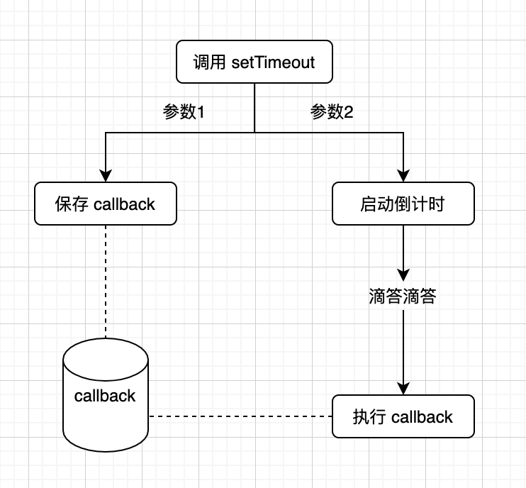
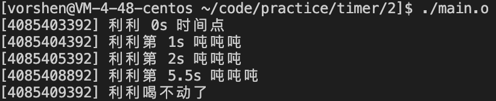
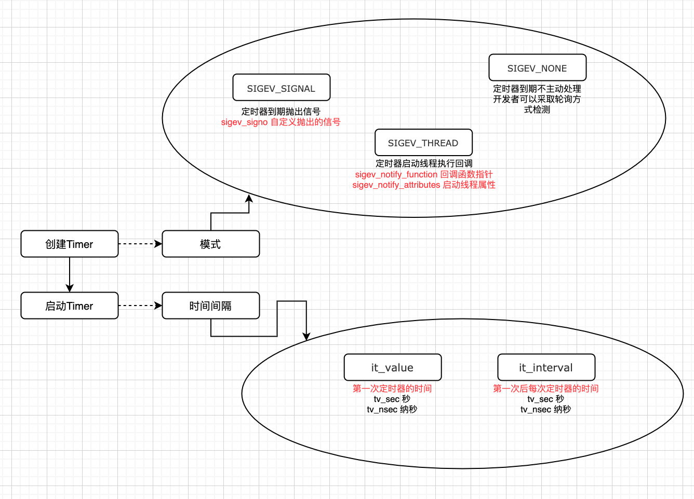
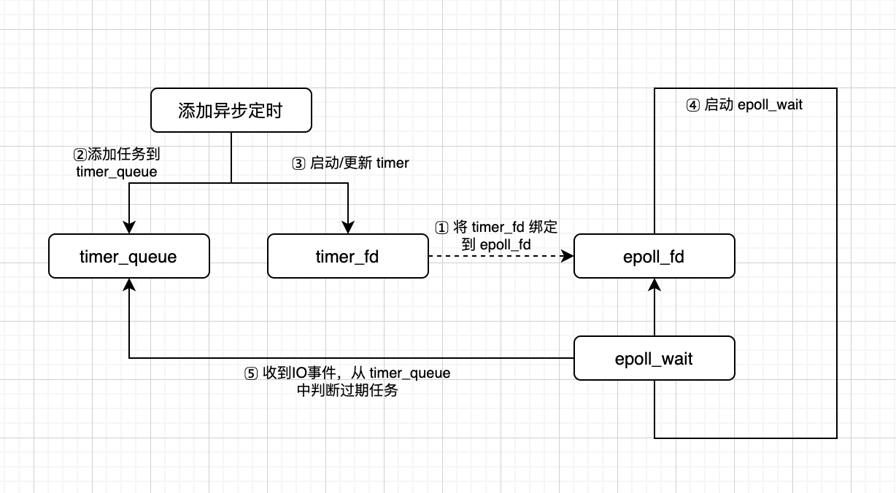

# 深入学习定时器
或许在生活中大家都讨厌定时器，比如周一早上的闹钟、承诺老板第二天一早给报告的 deadline；但是在代码的世界里，定时器扮演着不可或缺的角色：定时任务、超时判断、帧同步等等。  
那定时器的本质是什么？我们使用的定时能力背后又暗藏着什么玄机，请继续往下看。

## 目录
### 定时能力需要什么
### 信号
### POSIX Timer
### 多路复用

## 定时能力需要什么
javascript 的定时器能力应该是使用最为方便，默认的上下文捕获，函数式编程。
```
setTimeout(function() {
    console.log('利利喝多了');
}, 3000);

console.log('利利吨吨吨');
```
我们可以把 setTimeout 的执行，拆解一下，主要是以下的流程。  
  
1. 存放 callback
2. 启动一个倒计时
3. 倒计时结束，取出存好的 callback，RUN！
*BTW: JS 中定时器这么方便，不仅仅是 v8 的功劳，还需要执行环境(eg: chrome、node)给予支持。如果用 d8 去调试，会发现 setTimeout 并没有定时执行。*

核心需要解决1，2两个问题，先看存放 callback。**上层设置定时任务的顺序是不确定的，而最终的执行是有顺序的**，这里涉及到排序行为，并且**设置定时器的动作可能是多次的**。  
**由上条件，我们可以使用一个小根堆的数据结构来存放 callback。**
*BTW: 也有一种时间轮的方案，libco 中采取时间轮方案。*

那么该如何启动一个倒计时的钟摆呢？**从编程语言层面是没有倒计时相关 api 的**，还好操作系统内核给了我们一些解决方案。  
*BTW: 就好比说到 Linux 上定时任务，大家基本上都会想到 crontab，这也是内核给我们的能力的一种表现。*  

内核中具体的时钟能力如何实现，不是我们的重点，这会涉及到CPU时钟中断，再底层还有硬件相关，感兴趣的同学可以自行查阅。我们重点放在代码中如何去使用操作系统提供的时钟能力。  
对于程序来说，我们的诉求就是设定了一个时间，当该时间到达（可以理解为超时），内核可以通知到应用程序。那么有哪些通知方式呢？

## 信号方案
那么我们先看信号的方案，一说到信号，可能就会想到alarm(*sleep 走开*)，这里举个简单的🌰。
```
#include <unistd.h>
#include <stdio.h>
#include <signal.h>
#include <stdlib.h>

int curr = 0;
int max = 3;

void drink() {
    printf("利利吨吨吨\n");
    curr++;
    if (curr < max) {
        alarm(1); // 1s 后发出 SIGALRM 信号
    } else {
        kill(getpid(), SIGINT);
    }
}

void sigalrmCallback(int sig) {
    drink();
}

void sigintCallback(int sig) {
    printf("利利喝不动了\n");
    exit(0);
}

int main(int argc, char* argv[]) {
    signal(SIGALRM, sigalrmCallback); // 时钟定时信号
    signal(SIGINT, sigintCallback); // 终止信号

    drink();

    while (1) {
        pause(); // 等待信号
    }
    return 0;
}
```
结果就不截图了，代码比较好理解，核心就是围绕 SIGALRM 的监听和触发。  
不过这里有一些问题，我们一一来看下  
Q1: 精度问题，秒为精度，这太草了，肯定不能接受  
A1: 不过我们可以用其他函数代替，比如 setitimer *(精度为毫秒)* 

Q2: 无法多次调用 alrm
A2: 我们需要包装一层，处理多次调用的情况。

针对以上两个问题解法，这里有个改为 setitimer 优化版本，可见[这里](./example/setitimer/main.cc)。  
结果如下图  


但是别高兴的太早！问题还没有结束！  
Q3: 多线程情况下怎么办？  
A3: 信号在多线程下就是不灵活，一般做法需要用单独的线程去监听信号，其他线程屏蔽，写起来很麻烦。

Q4: 信号可靠性？无论是 alrm 还是 setitimer 都是发送非实时信号。  
A4: ？？？这太致命了，虽然是概率性的，但是总有在机场等艘船的感觉。

总结一下: 使用信号整体问题较多，虽然我们尝试了一些解决方案，但是还是会存在无解的问题，所以这里也没有真实使用信号的例子。

## POSIX Timer
针对刚刚的Q1到Q4，根本性在于 alrm 和 setitmer 都不够完善，为此 POSIX Timer 相关函数提供了解决方案。这一小节，我们主要看一下 POSIX Timer 相关函数，都是如何解决刚刚那些问题的。

1. 精度问题
POSIX Timer 支持程度更高，支持到纳秒级别

2. 无法多次调用
一个进程可以多次创建 Timer，相互独立
```
#include <unistd.h>
#include <stdio.h>
#include <signal.h>
#include <stdlib.h>
#include <pthread.h>

decltype(SIGRTMIN) SIG_DRINK = SIGRTMIN + 1;

void drink(u_int32_t second) {
    struct sigevent evp;
    timer_t timer;

    evp.sigev_notify = SIGEV_SIGNAL;
    evp.sigev_value.sival_ptr = &timer;
    evp.sigev_signo = SIG_DRINK; // 自定义信号

    int ret = timer_create(CLOCK_REALTIME, &evp, &timer); // 创建定时器
    if (ret) {
        printf("timer_create error\n");
    }

    struct itimerspec ts;
    ts.it_value.tv_sec = second / 1000;
    ts.it_value.tv_nsec = (second % 1000) * 1000;
    ts.it_interval.tv_sec = 0;
    ts.it_interval.tv_nsec = 0;

    ret = timer_settime(timer, CLOCK_REALTIME, &ts, nullptr); // 设置定时器
    if (ret) {
        printf("timer_settime error\n");
    }
}

int main(int argc, char* argv[]) {
    signal(SIG_DRINK, [](int sig) {
        printf("利利吨吨吨\n");
    });

    drink(3000);
    drink(2000);
    drink(1000);

    while (1) {
        pause();
    }
    return 0;
}
```
可以看到这里并不需要自己去处理多次调用，直接走创建定时器，设置定时器的流程就行。  

3. 多线程
POSIX Timer 提供了默认能力，当定时器结束的时候，可以启动线程执行对应的函数。而且在 Linux 下，还扩展提供了往指定线程发送信号的能力。  

4. 信号可靠性
POSIX Timer 也可以采用信号，不过不再局限于非实时信号，可以选择实时信号；而且还多了线程的方式。  

针对 POSIX Timer 的调用，下面画了一张图  
  
具体函数使用、结构等可以看官方文档，这里也给了一个简易封装的例子[posix 封装为 setTimeout](./example/posix/main.cc)。  
*BTW: 其实本质上 POSIX Timer 也是信号方案，可以观察进程信息中信号捕获。SIGEV_THREAD 模式下，会启动一个辅助线程，然后也是监听到 SIGTIMER 信号，再做后续处理，源码可见[https://code.woboq.org/userspace/glibc/sysdeps/unix/sysv/linux/timer_routines.c.html](https://code.woboq.org/userspace/glibc/sysdeps/unix/sysv/linux/timer_routines.c.html)。*

稍微总结一下，POSIX Timer 的方案，相比较之前已经完善了很多，不过还有一些缺点。  
1. 封装处理较为麻烦
2. 必须依赖 librt

使用该方案的开源项目有 gperftools，核心的代码位置在[https://github.com/greatmazinger/gperftools/blob/81d8d2a9e7f941a2051781fd0fe62c683c32f1ef/src/profile-handler.cc#L289](https://github.com/greatmazinger/gperftools/blob/81d8d2a9e7f941a2051781fd0fe62c683c32f1ef/src/profile-handler.cc#L289)。  
封装方式和上文中的例子差不多，只是模式不一样，这里就不详细讲解了。

## 多路复用
多路复用本身是为了解决服务器针对多连接时的阻塞问题，不过 select/poll/epoll 都提供了超时时间，而这一特性可以让我们使用到定时器中。  
以 boost 的 timer 为例，看如下代码
```
#include <iostream>
#include <boost/asio.hpp>

int main(int argc, char* argv[]) {
    std::cout << "利利喝！" << std::endl;

    boost::asio::io_service io;
    boost::asio::deadline_timer timer(io, boost::posix_time::seconds(3));
    timer.wait();

    std::cout << "3s后利利喝不动了！" << std::endl;

    return 0;
}
```
代码很好理解，我们看一下 boost 是如何实现一个同步的 timer.wait 能力的，顺着 deadline_timer_service 可以找到最后源码位置在[https://github.com/boostorg/asio/blob/develop/include/boost/asio/detail/impl/socket_ops.ipp#L2162](https://github.com/boostorg/asio/blob/develop/include/boost/asio/detail/impl/socket_ops.ipp#L2162)，简单到无需多余讲解。  
*BTW: 并且这里只用超时能力，不用担心 select 本身在多路复用中的性能问题。*

boost 中的异步定时器，也是采用了多路复用的方案，使用的是 epoll，其中用到了 timer_fd，先简单的说一下 timer_fd。  
**timer_fd 是 linux2.6.25 后增加的 api，算是官方形式将定时能力和IO事件结合了起来。**  
异步定时器相比较同步复杂很多，所以我们通过分析 boost 中异步定时器的源码来详细展开下。  
先画个图:  
  
然后我们依次看一下。  
1. 将 timer_fd 绑定到 epoll_fd 上  
epoll 使用一个文件描述符(epoll_fd)管理多个描述符(例如这里的 timer_fd)，这样在用户空间和内核空间的 copy 只需一次。  
**切记：这里 timer_fd 也需要进行复用，如果每次一个定时任务，都用一个新的 timer_fd，会有严重的性能浪费。**
```
// epoll_reactor.ipp

epoll_reactor::epoll_reactor(boost::asio::execution_context& ctx)
  : execution_context_service_base<epoll_reactor>(ctx),
    scheduler_(use_service<scheduler>(ctx)),
    mutex_(BOOST_ASIO_CONCURRENCY_HINT_IS_LOCKING(
          REACTOR_REGISTRATION, scheduler_.concurrency_hint())),
    interrupter_(),
    epoll_fd_(do_epoll_create()), // ❗创建了 epoll_fd(epoll_create)
    timer_fd_(do_timerfd_create()), // ❗创建了 timer_fd
    shutdown_(false),
    registered_descriptors_mutex_(mutex_.enabled())
{
  // Add the interrupter's descriptor to epoll.
  epoll_event ev = { 0, { 0 } };
  ev.events = EPOLLIN | EPOLLERR | EPOLLET;
  ev.data.ptr = &interrupter_;
  epoll_ctl(epoll_fd_, EPOLL_CTL_ADD, interrupter_.read_descriptor(), &ev);
  interrupter_.interrupt();

  // Add the timer descriptor to epoll.
  if (timer_fd_ != -1)
  {
    ev.events = EPOLLIN | EPOLLERR;
    ev.data.ptr = &timer_fd_;
    epoll_ctl(epoll_fd_, EPOLL_CTL_ADD, timer_fd_, &ev); // ❗关联 timer_fd 与 epoll_fd
  }
}
```
整体较好理解，几个重要的点增加了注释

2. 添加任务到 timer_queue  
```
// timer_queue.hpp

// Add a new timer to the queue. Returns true if this is the timer that is
// earliest in the queue, in which case the reactor's event demultiplexing
// function call may need to be interrupted and restarted.
bool enqueue_timer(const time_type& time, per_timer_data& timer, wait_op* op)
{
  // Enqueue the timer object.
  // 略

  // Enqueue the individual timer operation.
  timer.op_queue_.push(op);

  // Interrupt reactor only if newly added timer is first to expire.
  return timer.heap_index_ == 0 && timer.op_queue_.front() == op;
}

// The heap of timers, with the earliest timer at the front.
std::vector<heap_entry> heap_;
```
enqueue_timer 里面大部分代码我省略掉了，也就是在维护一个小根堆，让最近的定时任务在前面，这样可以方便第三步启动和更新 timerfd。  
*BTW: 这里小根堆并不是像我们之前 demo 用了 priority_queue 方式，而是每次 push_back 会去 swap 修改 vector。*

3. 启动/更新 timerfd
结合上一节的代码，当 enqueue_timer 返回 true 的时候，就会去更新/启动定时器。  
```
// epoll_reactor.hpp

bool earliest = queue.enqueue_timer(time, timer, op);
// ...
if (earliest)
  update_timeout(); // ❗更新定时器


// epoll_reactor.ipp

void epoll_reactor::update_timeout()
{
#if defined(BOOST_ASIO_HAS_TIMERFD)
  if (timer_fd_ != -1)
  {
    itimerspec new_timeout;
    itimerspec old_timeout;
    int flags = get_timeout(new_timeout);
    timerfd_settime(timer_fd_, flags, &new_timeout, &old_timeout); // ❗设置 timerfd
    return;
  }
#endif // defined(BOOST_ASIO_HAS_TIMERFD)
  interrupt();
}
```
注意：如果不支持 timerfd，则会直接调用 epoll_ctl。

4. 启动 epoll_wait
5. 收到 IO 事件，从 timer_queue 中判断过期任务
这两步的代码位置太过相近，就放一起来说了。  
```
// epoll_reactor.hpp

void epoll_reactor::run(long usec, op_queue<operation>& ops)
{
  // This code relies on the fact that the scheduler queues the reactor task
  // behind all descriptor operations generated by this function. This means,
  // that by the time we reach this point, any previously returned descriptor
  // operations have already been dequeued. Therefore it is now safe for us to
  // reuse and return them for the scheduler to queue again.

  // Calculate timeout. Check the timer queues only if timerfd is not in use.
  int timeout;
  if (usec == 0)
    timeout = 0;
  else
  {
    timeout = (usec < 0) ? -1 : ((usec - 1) / 1000 + 1);
    if (timer_fd_ == -1)
    {
      mutex::scoped_lock lock(mutex_);
      timeout = get_timeout(timeout);
    }
  }

  // Block on the epoll descriptor.
  epoll_event events[128];
  int num_events = epoll_wait(epoll_fd_, events, 128, timeout); // ❗核心

  // ...

#if defined(BOOST_ASIO_HAS_TIMERFD)
  bool check_timers = (timer_fd_ == -1);
#else // defined(BOOST_ASIO_HAS_TIMERFD)
  bool check_timers = true;
#endif // defined(BOOST_ASIO_HAS_TIMERFD)

  // Dispatch the waiting events.
  for (int i = 0; i < num_events; ++i)
  {
    void* ptr = events[i].data.ptr;
    if (ptr == &interrupter_)
    {
      // No need to reset the interrupter since we're leaving the descriptor
      // in a ready-to-read state and relying on edge-triggered notifications
      // to make it so that we only get woken up when the descriptor's epoll
      // registration is updated.

#if defined(BOOST_ASIO_HAS_TIMERFD)
      if (timer_fd_ == -1)
        check_timers = true;
#else // defined(BOOST_ASIO_HAS_TIMERFD)
      check_timers = true;
#endif // defined(BOOST_ASIO_HAS_TIMERFD)
    }
#if defined(BOOST_ASIO_HAS_TIMERFD)
    else if (ptr == &timer_fd_)
    {
      check_timers = true;
    }
#endif // defined(BOOST_ASIO_HAS_TIMERFD)
    else
    {
      // The descriptor operation doesn't count as work in and of itself, so we
      // don't call work_started() here. This still allows the scheduler to
      // stop if the only remaining operations are descriptor operations.
      descriptor_state* descriptor_data = static_cast<descriptor_state*>(ptr);
      if (!ops.is_enqueued(descriptor_data))
      {
        descriptor_data->set_ready_events(events[i].events);
        ops.push(descriptor_data);
      }
      else
      {
        descriptor_data->add_ready_events(events[i].events);
      }
    }
  }

  if (check_timers) // ❗check_timers 为 true 意味着需要检测定时器队列
  {
    mutex::scoped_lock common_lock(mutex_);
    timer_queues_.get_ready_timers(ops); // ❗获取已经完成状态的事件并执行

#if defined(BOOST_ASIO_HAS_TIMERFD)
    if (timer_fd_ != -1)
    {
      itimerspec new_timeout;
      itimerspec old_timeout;
      int flags = get_timeout(new_timeout);
      timerfd_settime(timer_fd_, flags, &new_timeout, &old_timeout); // ❗继续设置定时器
    }
#endif // defined(BOOST_ASIO_HAS_TIMERFD)
  }
}
```
重点的就是有❗标志的代码。  
timer_queues 里面发现的过期事件会添加到 op_queue 里面去，如下：  
```
// timer_queue.hpp

virtual void get_ready_timers(op_queue<operation>& ops)
{
  if (!heap_.empty())
  {
    const time_type now = Time_Traits::now();
    while (!heap_.empty() && !Time_Traits::less_than(now, heap_[0].time_))
    {
      per_timer_data* timer = heap_[0].timer_;
      ops.push(timer->op_queue_);
      remove_timer(*timer);
    }
  }
}
```
op_queue 会在 scheduler.ipp 内进行执行。

以上就是 boost 中的异步定时器执行分解，感兴趣的同学也可以自己下源码来学习。  
*BTW: libevent 中定时任务做法与 boost 基本一致，chromium 底层的 message_pump 也有使用 libevent*

## 总结
我们了解到需要实现一个定时器/定时任务，重点需要两块：  
1. 存放执行回调的地方  
大部分选择是小根堆的方案，简单方便；也有时间轮的方案。
2. 调用操作系统提供的定时能力  
我们分析了「信号」「POSIX Timer」「多路复用」，信号 pass，后二者中更推荐多路复用一些。  
分析了 boost asio 的源码，学习了多路复用能力用在定时方面的解决办法。  
如果你还想了解的更多，可以学习 libevent、libco、chromium 中定时器方面采取的方案。  
欢迎一起讨论研究～  