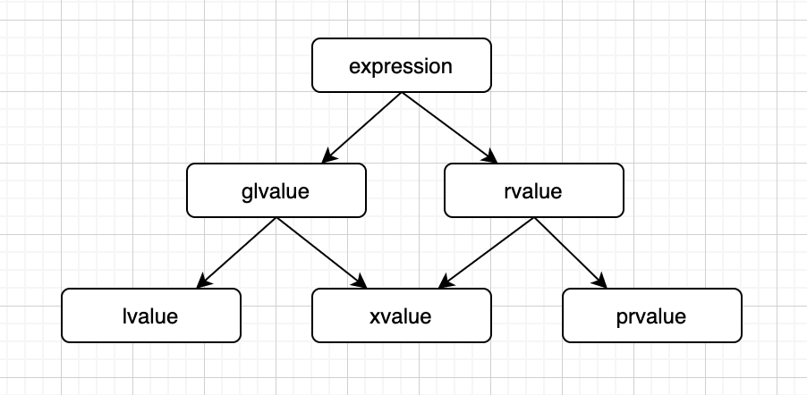
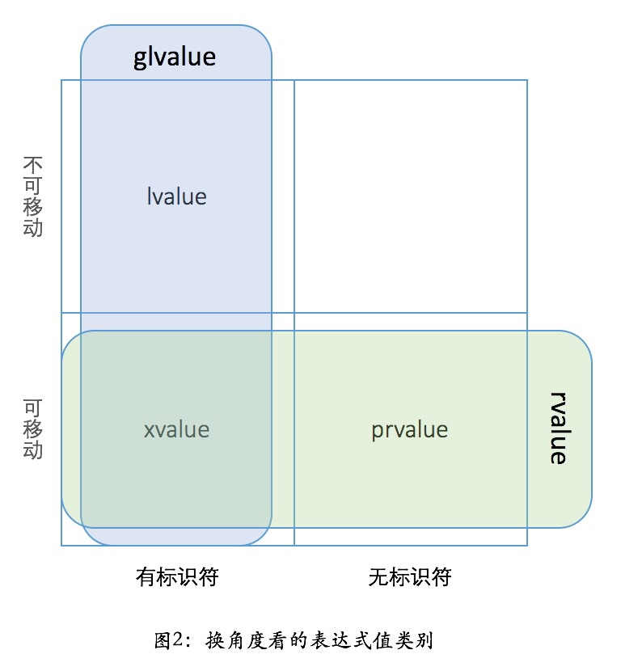

# 值类别
关于左值右值的文章很多，官方也有[https://zh.cppreference.com/w/cpp/language/value_category](https://zh.cppreference.com/w/cpp/language/value_category)详细的描述，不过这里实在是比较重要，还是自己也总结一份，加深印象。  

# 前置准备
## 变量和值
这东西是两码事，大家基本上也能很清晰的分辨出，这里就简单走一下过场再加深一下印象。  
```
int main(int argc, char* argv[]) {
    int a = 3;
    int& b = a;
    int c[2] = { 1, 2 };
    string d = "lili drink";
    Yori* e = new Yori;

    return 0;
}
```
变量对应的是类型，有两个大粒度的划分是**基础类型**、**复合类型**。复合类型里面会再区分引用类型、指针类型、数组、函数等。  
还有简单的划分方式为**值类型**、**引用类型**。

值对应的是类别，也就是左值右值，后面具体展开，也就是本文的重点。

## 引用
这里说的是引用类型，不针对指针（有些说辞中，对标值类型的时候，也会把指针类型划分到引用类型中去）。  
引用类型比较特殊的地方就在于它必须显式初始化。  

其实写代码中，像值类型大家基本上都会进行显式的初始化，因为值类型的变量，在不同作用域下的表现是不一致的，与其记住各种 case，不如老老实实显式初始化。  
但以上也表明了，**值类型是可以不显式初始化的**，后面再赋值也可以。但是引用类型就不行了，**必须在创建的时候显式初始化**。

# 左值右值
这里按 C++17 标准进行细化，先给一张图:  
  
重点是理解最下面一层。  

## lvalue
称为**左值**，首先要明确的是左值并不是一定要在等号的左边，其最重要的性质为: **有标识符，可以使用取地址符获取地址，不可移动**。
然后列举一些左值表达式。
- 变量，函数、数据成员的名字。
- 内建的一些赋值、自增等表达式，比如 ++a, a += b。
- 字符串字面量，比如 "yori drink"。

字符串字面量这个比较特殊，单独说一下，首先看下面这段代码。
```
void test(string& str) {
    printf("left reference\n");
}

void test(string&& str) {
    printf("right reference\n");
}

int main(int argc, char* argv[]) {
    printf("address: %p\n", &"yori drink");

    test("yori drink");

    return 0;
}

// 输出结果
address: 0x400930
right reference
```
首先我们看到一个字符串字面量我们是可以取地址的，合法行为，那么就满足了我们左值的特性，证明了字符串字面量是左值。  
但是下面那个函数调用就很特别了，理论上来说左值的话应该输出 *left reference* 才对，但是这里输出的确实 *right reference*，**这里是命中了数组（字符串字面量可以看成char[]）转为指针的特性，然后当作右值传递**。  
证据的话，上面的代码我们只需要保留 T& 形参的函数签名，会发现编译报错，以此证明。

再说一个左值的特点，就是一个对于函数参数来说，**参数类型可能是右值引用，但变量是一个左值**。可以看如下代码来理解:  
```
class Yori {
public:
    int a = 0;

    Yori(int a): a(a) {};
    Yori(const Yori& other) = delete;
    Yori(Yori&& other) {
        this->a = other.a;
    }
    Yori& operator=(const Yori& othrt) = delete;
    Yori& operator=(Yori&& other) {
        this->a = other.a;
        return *this;
    }
};

Yori test(Yori&& val) {
    return val;
}

// 编译报错
error: use of deleted function ‘Yori::Yori(const Yori&)’
   return val;
```
可以看到，这里当拷贝赋值操作被 delete 之后，编译报错，并没有走移动赋值。就是因为 test 的参数 val，虽然类型是右值引用，但是有标识符，可以取地址，左值的不能再左了。

## prvalue
称为**纯右值**，其重要的性质为: **没有标识符，不可以取地址，可移动**。  
然后列举一些纯右值表达式。  
- 除字符串字面量之外的字面量（无法 &1024 取地址的）
- 返回类型是非引用的函数调用或表达式
- 转换为非引用类型的转型表达式，比如 static_cast<double>(x)

prvalue 本身其实没什么好说的，不过重点可以说一下生命周期延长的特点。

一个变量的生命周期和其作用域是挂钩的，而 prvalue 的作用域非常的小，因为它没有标识符，也就意味着它只起一个**临时**的作用，所以它的生命周期只是在表达式中，表达式完成之后，prvalue 理论上就会销毁。比如如下代码:  
```
class Yori {
public:
    Yori() {
        printf("Yori Constructor\n");
    }
    ~Yori() {
        printf("Yori Destructor\n");
    }
};

class Yussica {
public:
    Yussica() {
        printf("Yussica Constructor\n");
    }
    ~Yussica() {
        printf("Yussica Destructor\n");
    }
};

int main(int argc, char* argv[]) {
    printf("main start\n");
    Yussica y1;
    Yori();
    printf("main end\n");

    return 0;
}

// 结果如下
main start
Yussica Constructor
Yori Constructor
Yori Destructor
main end
Yussica Destructor
```
无需过多解释，可以看到 prvalue Yori 的构造函数和析构函数执行时机就在表达式那一步。  
但此时如果我们将其绑定到引用上，便可以延长生命周期了，如下代码: 
```
int main(int argc, char* argv[]) {
    printf("main start\n");
    Yori&& y = Yori();
    printf("main end\n");

    return 0;
}

// 结果如下
main start
Yori Constructor
main end
Yori Destructor
```

## xvalue
称为**将亡值**，其重要的性质为: **有标识符，不可以取地址，可移动**。  
然后列举一些将亡值表达式。 
- 返回类型为对象的右值引用的函数调用或重载运算符表达式，比如 std::move(x)
- 转换为对象的右值引用类型的转型表达式，比如 static_cast<char&&>(x)

将亡值有一个特点，是关于上一节说的生命周期延长的，先看如下代码:  
```
class Yori {
public:
    Yori() {
        printf("Yori Constructor\n");
    }
    ~Yori() {
        printf("Yori Destructor\n");
    }
};

int main(int argc, char* argv[]) {
    printf("main start\n");
    Yori&& y = std::move(Yori());
    printf("main end\n");
    return 0;
}

// 结果如下
main start
Yori Constructor
Yori Destructor
main end
```
发现尝试引用延长生命周期失效了！这里务必注意，如果命中了这个特点，可能会引起难以发现的 bug。  

## glvalue、rvalue
这两者是混合类别，相当于是逻辑总结层面了，核心便是将上面说的特性组合一下。一般来说一个值究竟是什么类别，还是用 lvalue,prvalue,xvalue 来区分。  

不过极客时间吴咏炜老师有列得另一个纬度看左值右值的图，如下，这个我觉得挺清晰的。  
  

# 总结
文章目的主要是梳理一下这块的知识点，因为这里比较绕，但是作为基础知识又很重要。描述的感觉很多地方还是不清晰，有空回来改改完善完善。

参考资料:  
[https://zh.cppreference.com/w/cpp/language/value_category](https://zh.cppreference.com/w/cpp/language/value_category)  
[https://time.geekbang.org/column/article/169268](https://time.geekbang.org/column/article/169268)  
[https://zhuanlan.zhihu.com/p/107445960](https://zhuanlan.zhihu.com/p/107445960)