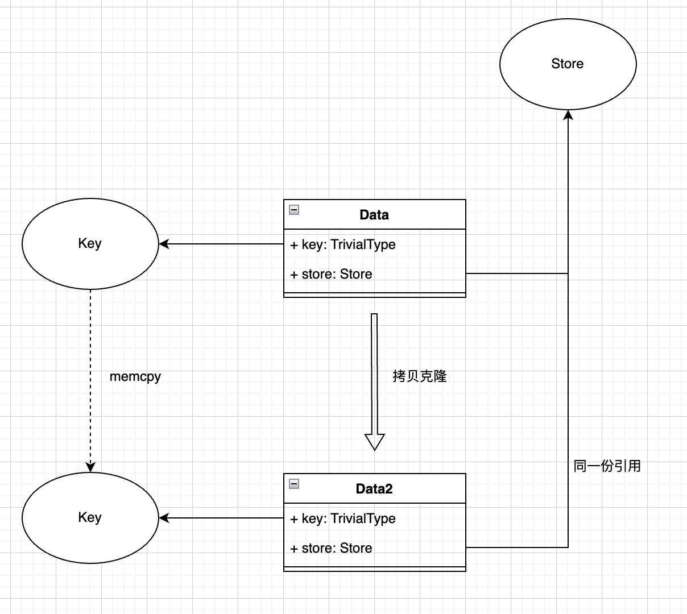

# 对象拷贝二三事
最近遇到一个高性能拷贝的方案，这里水一篇文章讲讲对象的拷贝。

## javascript 中的拷贝
### 引用与拷贝
先提目前世界上最火的语言，javascript 中拷贝，说复杂不复杂，说简单也需要注意一些细节。首先因为语言的一些限制，涉及到对象的并非是真正的**拷贝**，而只是**引用**。  
```javascript
// 基础类型
const v1 = 20;
// 基础类型的赋值，通过拷贝实现的
const v2 = v1;

// 复杂类型
const obj1 = {
  v: 1,
};
// 复杂类型的赋值，通过引用实现
const obj2 = obj1;
obj1.v++;
// 此时 obj2.v === 2
console.log(obj2.v);
```
这里带来的一个问题就是，任何复杂类型的传递，可能都是引用，那么对你的函数作用域参数的一个修改，可能对外层上下文带来不可预料的影响。  

```javascript
const someData = {
  // ...
};

doSomething1(someData);
doSomething2(someData);
doSomething3(someData);
// 此时还敢保证 someData 还是最初的模样吗？
```
这里的本质是，一个输入参数可能被**无意间**当成输出参数使用，毕竟 javascript 语言的优点就在于自由，而有可能给你自由过了火。

为了解决这个问题，有两种解决思路：
- 立下代码规范，禁止修改函数的参数，但是这种方式我不赞成一巴掌全部拍死，详情可见[函数返回值那些事](https://github.com/vorshen/blog/blob/master/function/return-value/index.md)其中的说法。
- 通过 `Object.freeze` 来处理。
```javascript
const someData = {
  a: 1,
};
Object.freeze(someData);
someData.a = 2;
someData.b = 0;

console.log(someData); // {a:1}
```
看起来效果确实达到了，并且如果在严格模式就更厉害了，出现修改操作可以直接 `throw error` 出来。但是 `freeze` 有了，`unfreeze` 呢？？？所以当外层上下文真的需要改变 someData 的时候只能寄！

不管方案1还是方案2，它们的本质都是禁止修改参数，当你真的需要把参数当成输出的时候，它们给你的建议一般是：**拷贝**一份，然后通过 `return` 返回。

所以真正的 javascript 中的拷贝来了。

### 如何拷贝
既然语言本身针对复杂类型的赋值操作并不是拷贝，那就靠开发自己来。

首先呈现的是奇技淫巧之 `JSON.parse(JSON.stringify())`。
```javascript
const a = {
  v1: 100,
  v2: false,
  v3: null,
  v4: 'xxx',
  v5: {
    t: 'yyy'
  }
};

const cloneA = JSON.parse(JSON.stringify(a));
console.log(cloneA);  // {v1: 100, v2: false, v3: null, v4: 'xxx', v5: {t: 'yyy'}}

///////////////////////////////

const b = {
  v1: undefined,
  v2: function() {
    console.log('xxx')
  }
};

const cloneB = JSON.parse(JSON.stringify(b));
console.log(cloneB);  // {}
```
cloneA 看起来还一切正常，但是 cloneB 就变得不可控制起来……  
v1 是 `undefined`，丢掉还能接受，但是 v2 明明是一个 `function`，这丢掉肯定是不能接受的。

所以 `JSON.parse(JSON.stringify())` **在正常情况下不要用来拷贝对象**，请把风险扼杀在摇篮里。

不用奇技淫巧也是因为正规的方案其实很方便，网上有很多完善的 `deepClone` 库，随便搜一搜就很多。  
找个名气大 star 多的，比如 `lodash.deepclone`，某乎上也有比较详细的源码分析: [lodash源码分析——deepclone
](https://zhuanlan.zhihu.com/p/41699218)。

### 跨线程拷贝
刚刚提到 `JSON.parse(JSON.stringify())` 的时候，最后的结论是**正常情况下**不要使用。  
这句话换个意思就是，存在特殊情况，可能还是得使用该方法，没错，这里说的就是跨线程通信的情况。  
*(注意：这里用到也是辅助的形式，而不是说靠它实现了拷贝)*

我们可能某些场景下，会希望某个 worker 线程帮我们计算些东西，然后**结果**返回给主线程。  
**结果**可能是一个复杂类型的对象，而 javascript 因为安全问题，不同线程间是无法共享内存的，必须通过 `postMessage` 的方式通讯。

我们看下面这个栗子:  
```javascript
// in worker context
postMessage({
  a: 100,
  b: 'xxx',
  c: function() {}
});
// 报错
// Uncaught DOMException: Failed to execute 'postMessage' on 'DedicatedWorkerGlobalScope': function() {} could not be cloned.

postMessage(JSON.stringify({
  a: 100,
  b: 'xxx',
  c: function() {}
}));
```
可以看到，执行第一个 `postMessage` 的时候，会报错，因为浏览器无法直接共享参数对象，必须要进行一种类似的序列化处理，而 `function` 类型在处理的时候会异常。  
所以一般来说，为了安全，我们都会在 worker 那边进行 `JSON.stringify()`，然后在主线程进行 `JSON.parse()`。

这样传递的其实是**存粹的数据**，如果你希望在主线程能**还原成真实的对象类型**，就需要在主线程进行反序列化。

## c++ 中的拷贝
### 如何满足拷贝
在 C++ 语言层面中，就没有默认进行什么引用之类的处理，赋值正常来说就是拷贝，如果你想要引用，就必须显示的使用引用的语法。
```cpp
std::string a("xxxx");

std::string b = a;  // 拷贝
std::string& c = a;  // 引用

a += 'y';

printf("b: %s\n", b.c_str());
printf("c: %s\n", c.c_str());

// 输出
b: xxxx
c: xxxxy
```
那是不是 C++ 中万物皆可以拷贝呢？当然不是的，某些对象，就是明确禁止拷贝的。
```cpp
auto t = std::cout;
// 编译报错
// error: use of deleted function ‘std::basic_ostream<_CharT, _Traits>::basic_ostream(const std::basic_ostream<_CharT, _Traits>&) [with _CharT = char; _Traits = std::char_traits<char>]’

// 我们只需要将赋值运算符标为 delete，就无法再进行拷贝行为了
class Foo {
 public:
  Foo() = default;
  Foo(const Foo&) = delete;
  Foo& operator=(const Foo&) = delete;
};
```
经过上面这个可知，对象拷贝其实本质上走了拷贝赋值运算函数或者拷贝构造函数，那有没有性能更好的方法呢？

那就是下面说的高性能拷贝的方案。

### 高性能的拷贝
相比较通过拷贝赋值运算函数等处理，直接内存操作肯定效率更高，这里我们就想到了使用 `memcpy`。  
*(在 STL 中，如果容器内的元素类型拥有平凡拷贝赋值函数，就会直接进行 `memcpy`)*

这里给一下测试性能的例子:
```cpp
class Foo {
 public:
  Foo() = default;
  Foo(const Foo&) = default;
  Foo& operator=(const Foo&) = default;
  int v1 = 2;
  char v2 = 'x';
};

int main(int argc, char* argv[]) {
  Foo f;
  Foo f2;

  auto time_start = std::chrono::steady_clock::now();
  for (int i = 0; i < 100000; ++i) {
    f2 = f;
  }
  printf("time: %lfms\n", std::chrono::duration<double, std::milli>(std::chrono::steady_clock::now() - time_start).count());

  time_start = std::chrono::steady_clock::now();
  for (int i = 0; i < 100000; ++i) {
    std::memcpy(&f2, &f, sizeof(f));
  }
  printf("time: %lfms\n", std::chrono::duration<double, std::milli>(std::chrono::steady_clock::now() - time_start).count());
  return 0;
}
```
以上10w次拷贝执行，无论是O0还是O3编译，性能差距大概是3倍，`memcpy` 相比较拷贝赋值函数确实快了很多。

所以这里也算是个业界通用的优化方式，但是这里的问题在于要求元素必须是**平凡的**拷贝赋值函数。  
**当上层业务的数据结构变得不平凡怎么办？**

先给结论吧，当需要存在不平凡结构的时候，高速拷贝可能就是如下的方案:  


其实也比较好理解，用 key-value 的模式，key 必须是平凡的，然后 store 其实是一份引用，这样每次拷贝的成本也就是 key 进行 `memcpy` 的成本。

不过这里需要注意的是，编辑类型的操作，比如插入、修改，都是不能去**更新** store，而是要通过**新增**的形式。

思路不算复杂，大抵就是如此，其中会有一些细节可以深究。感兴趣的同学可以自己尝试写一写。