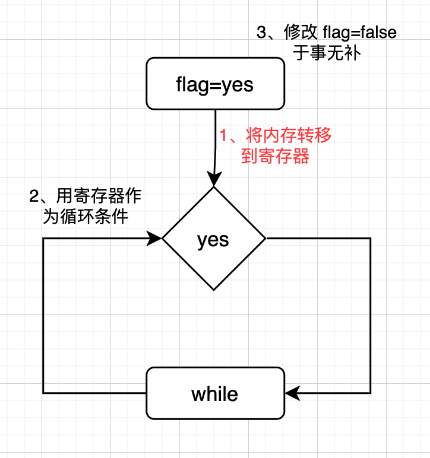

# volatile
今天简单聊一聊 volatile 关键字，先从背景说起。  

作为程序员，**性能优化**是搬砖中不可或缺的一部分，更有很多人将*我能超过标准库*作为人生一大梦想。有幸的是，除了产品经理外，基本上每个人都会时时刻刻惦记着性能优化，包括编译器。  
```
int run() {
    int i = 0;
    for (; i < 100; i++) {}

    return i;
}

int main(int argc, char* argv[]) {
    int result = run();
    printf("%d \n", result);
    return 0;
}
```
以上的代码如果按正常来说，i 会执行 100 次自增的计算，如果非编译状态下查看汇编代码也确实如此。  
```
0000000000000000 <_Z3runv>:
   0:   55                      push   rbp
   1:   48 89 e5                mov    rbp,rsp
   4:   c7 45 fc 00 00 00 00    mov    DWORD PTR [rbp-0x4],0x0
   b:   83 7d fc 63             cmp    DWORD PTR [rbp-0x4],0x63
   f:   7f 06                   jg     17 <_Z3runv+0x17>
  11:   83 45 fc 01             add    DWORD PTR [rbp-0x4],0x1
  15:   eb f4                   jmp    b <_Z3runv+0xb>
  17:   8b 45 fc                mov    eax,DWORD PTR [rbp-0x4]
  1a:   5d                      pop    rbp
  1b:   c3                      ret    
```
但是！如果我们增加参数让编译器来优化，编译器会直接将优化拉满，**增加 -O3 后**:  
```
0000000000000000 <_Z3runv>:
   0:   b8 64 00 00 00          mov    eax,0x64
   5:   c3                      ret
```
直接返回 100，不给你整那些花里胡哨的，由此可知，编译器在优化代码的时候，下手很重的。  
但是这也面临了编译器可能会好心干坏事的情况，特别是和线程安全挂钩的时候，比如如下代码:  
```
bool flag = true;

void drink(bool& flag) {
    flag = true;
    while (flag) {
        printf("利利吨吨吨 \n");
        sleep(1);
    }
}

void stop() {
    flag = false;
    printf("利利喝不动了 \n");
}

int main(int argc, char* argv[]) {
    thread t1(drink);
    
    sleep(2);
    thread t2(stop);
    t1.join();
    t2.join();

    return 0;
}
```
**这是我从网上找的然后翻译过来，说明 volatile 问题的一段代码**，我们先分析一下问题可能出现在哪。  
flag 变量被两个线程访问到，而线程中内存共享，但是寄存器互相独立，也就是说，如果线程1将 flag 为了优化，从内存中先读寄存器中，在进行判断，那就 GG 了，如下图所示:  
  
可以看到罪魁祸首就是红色的第一步，但那也是编译器在为性能考虑，尝试优化所致。  

此时我们文章的主角 volatile 就可以崭露头角了，volatile 可以将变量声明为易变。  
之后只要使用 volatile 修饰过的变量，编译器一定保证从内存中换取，不会从寄存器中获取。

总结:  
锁只能解决内存级别的线程冲突，但由于不同线程间，虽然内存共享，但是寄存器独立，所以当内存中的变量存入寄存器时（编译器优化），依然会出现冲突问题。此时需要 volatile 指明变量是**易变的**，不允许进行上面说的内存到寄存器的优化。  